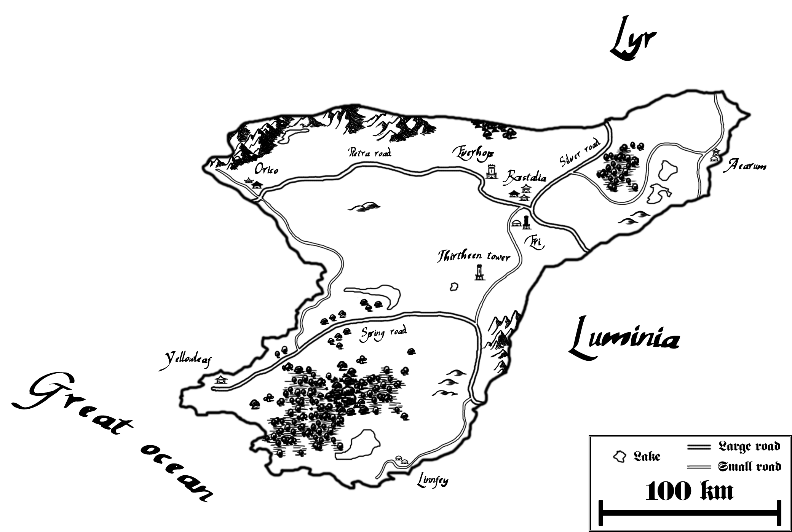
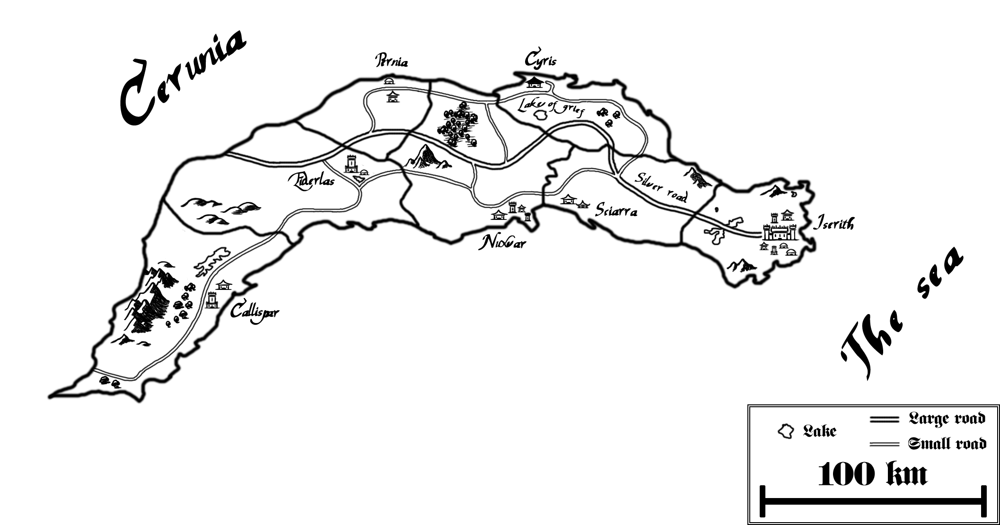
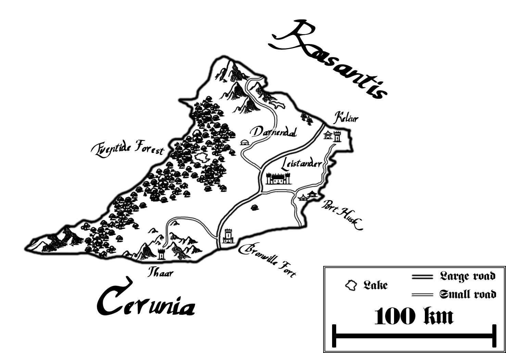
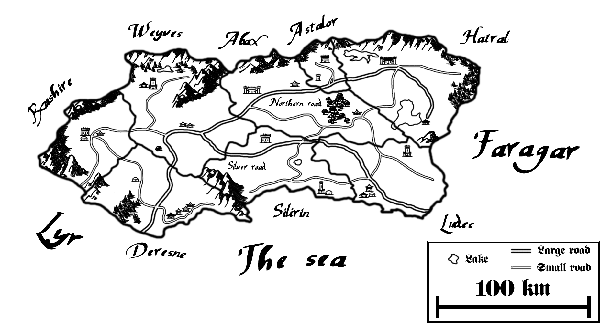
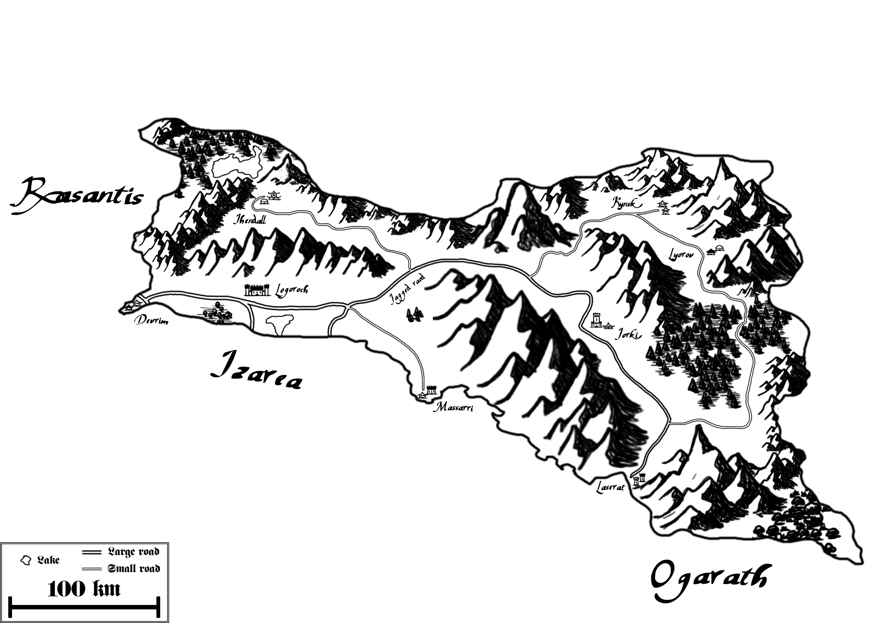
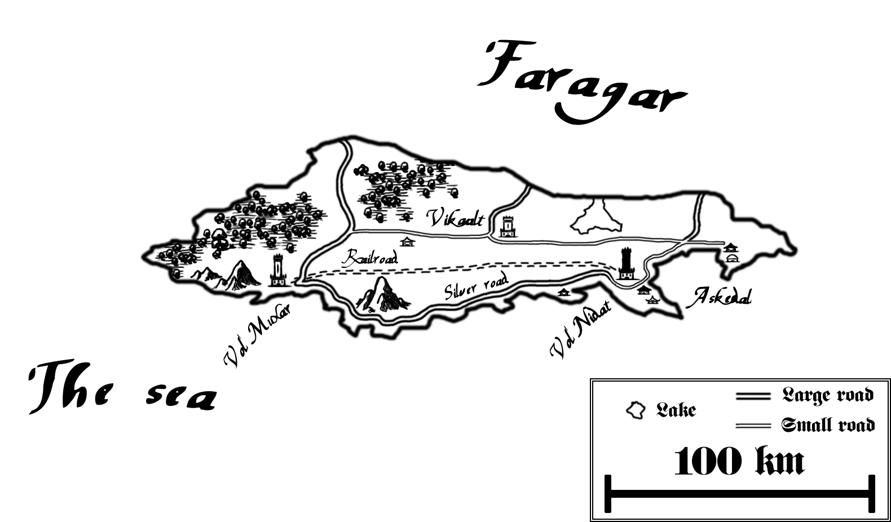
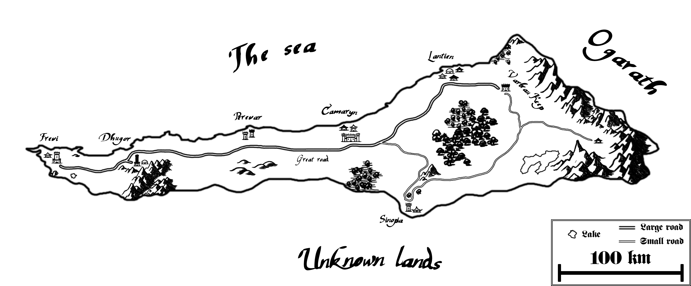
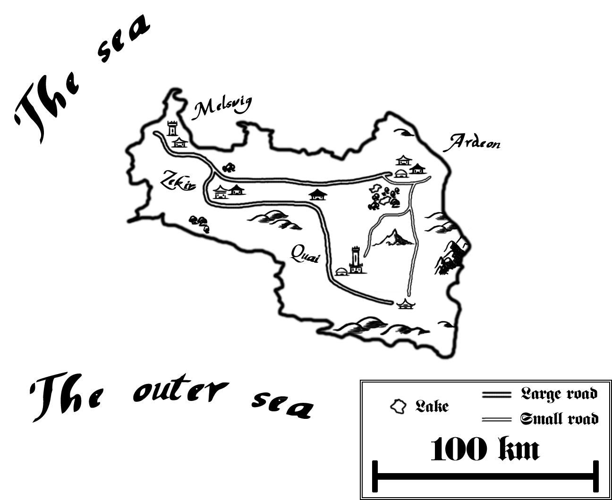

# Countries

*Here are presented the states in which Veridia is divided today.\
For each, after having explored its history, we describe the lifestyle of its inhabitants and introduce the most iconic places.*

#### Index:

* [Cerunia](#S-cerunia)
* [In-depth: Cerunian magic restoration](#S-cerunian_restoration)
* [Luminia](#S-luminia)
* [Lyr](#S-lyr)
* [Rasantis](#S-rasantis)
* [Faragar](#S-faragar)
* [Izarea](#S-izarea)
* [Belusa](#S-belusa)
* [Ogarath](#S-ogarath)
* [Aegos Islands](#S-aegos_islands)
* [Xanas](#S-xanas)

## Cerunia

### History

Between the inner sea and the great ocean lies the biggest country of western Veridia, Cerunia. There, the human civilization has ancient roots; in fact, the first man powerful enough to be worthy of the title of king was of Cerunian's lineage. He was the first of the famed yet short-lived Roothrig dynasty, and ruled for the incredible length of 63 years.

Magic is the pride of Cerunia, even if its exact origins are rumored to be from somewhere in Lyr. However, there's no doubt that today Cerunia is the center of the magic society.

After a bright start in the beginning of the first millennium, the Kingdom of Cerunia had to endure a period of stagnation, caused mostly by an unlucky string of irresponsible or simply bad rulers. As rebellion has never been in the local people's blood, the situation improved only after the Empire took control of the land; it was a pleasant time for the country's economy because it could benefit from the technological innovations made in the more advanced Lyr and Luminia.

The Empire's fall brought a short moment of disorientation for Cerunia. However, the Magic Council was quick to take action, putting on the throne a weak king, easy to manipulate. 

The huge amount of power exerted by the Council and later also by the Mage Order, has saved Cerunia from falling behind the rest of western Veridia in terms of wealth and reputation. On the other side, it has created a strange equilibrium in which the royal family is almost a puppet in the hands of two masters. Thus, excluding the events involving the magic society or the knights, few noteworthy episodes have happened in Cerunia in the last five hundred years.

The people have, by now, put aside their bitterness towards Lyr; the old clashes between the two states are nothing more than a distant memory, almost forgotten.

### The country

While its territory is large, Cerunia's population density is average at best, surely much less than the one in its neighbour countries. The majority of people live in the big towns or in the middle sized centers situated along the great roads. These roads are impressive infrastructures built by the Empire to improve the commercial routes; Cerunia has three main roads and another five, minor ones, that connect the towns on the ocean to the rest of Veridia. 

Far from the travel routes life is rural; there are vast spaces rich of vegetation and wild animals, with a sporadic fortress or watch tower placed in a key location.

The climate is temperate and it benefits from the sea's presence. Cerunia is considered a good place to live in, for what concerns the weather and the lifestyle; the latter has a nice balance between the time spent doing social and work activities and the time spent around nature.

The Cerunian citizens are not the richest or the most interested in science, but they usually have good survival skills and a considerable familiarity with magic. Speaking of which, Cerunia is home to the well-known Council and the principal schools of spellcrafting. It's every wizard's dream to study in one of the country's prestigious academies, or, even better, to be part of the highly praised Inner Circle.

Due to the high concentration of practitioners of any skill level, magic services are cheaper than in the rest of Veridia, so cheap that even commoners can afford one from time to time.

The best shops have also magic items available for purchase, like mantles or tunics, albeit at a quite high price; it means that, in practice, only the rich can afford these goods. Anyhow, the possibility to acquire such peculiar items is still a remarkable fact.

By the way, Cerunia is the only place where the city guard regularly uses the wizards' help. Spellcrafters are hired to set up defensive enchants in the most crowded locations, to protect the citizens, or to put countermeasures against criminals or thieves.

King Mark Aguus sits firmly on the kingdom's throne, his family notoriously supported by both the Order and the Council. He's not at all a bad leader: like his father before him, he has shown on multiple occasions to possess notable wits and wisdom, of course in the limits of what his 'restricted' authority let him do.

The Cerunian royal family, as well as the national army, has little relevance on Veridia's political scene. After all, Cerunia is best known for hosting two formidable independent organizations, not for its modest aristocracy.

The Mage Order has a firm grasp over the country's local affairs; currently, it's more concerned about the events happening in the rest of Veridia, and it's organizing an ever-increasing number of abroad expeditions.

The Magic Council is dealing with a bit of internal turmoil caused by the Cerunian elemental schools. The latter are divided about whether or not they should expand their presence outside the country's borders. The less influential schools support the expansive policies, with the hope of getting a chance to acquire prestige in new lands, while the oldest, well-established ones are content with the current situation and oppose any potential change in the balance of power.

Theoretically, the Inner Circle should be above such petty disputes, but since it's composed essentially by the top members of these schools, it's impossible to completely avoid political pressures, that then might cause repercussions on the Coucil's stability.

### Places

#### Thirteenth tower

It's the most famous of the Council's towers. Here, since the sixth century, when the structure was built by order of the high archmage Ittori, magicians of every school discuss matters of the utmost importance.

The tower has gone through several modifications during its long life; it's common practice for the high archmage to abandon his former laboratory, then settling in the thirteenth tower and modifying it to his liking. A demonstration of power or, perhaps, only a cheap showing of vanity.

#### Everhope

Everhope is the biggest fortress of the Mage Order. Situated near the country's capital, it has large spaces dedicated to the knights' living quarters and educational facilities. Also, the arguably mightiest prison of all Veridia is right under the fortress, guarded night and day by some of the Order's most skilled combatants.

Unlike others important buildings, Everhope can be visited freely by commoners, who use this opportunity to trade or parley with the knights. As everyone known, the Mage Order is very confident in its power, hence it doesn't fear intruders or enemy attacks.

#### Orico

Orico lies in the western coast, facing the great ocean, and it's the principal center of human activities in the region.

There, the people live off fishing, farming and trading; the town is renown for its laid back attitude and its nice food. Some adventurers are particularly fond of Orico, especially the ones that are fascinated by the ocean and its challenges. 

Finally, the city has a few niche shops in addition to a well-stocked marked district.

#### Restalia

Capital of Cerunia and official residence of the royal family. It hasn't a huge population, but it offers very secure streets in addition to large houses and many open spaces rich of trees.

The Magic Council manifests its presence in the city thanks to the fifth tower, which is inside the stone walls; the tower's master has the important task of overseeing and advising the king on the Council's behalf.

#### Eri

Also called the city of magic, not without a reason. Primary and secondary spellcrafting schools have, at least, one embassy in this center. The magic and alchemy shops of Eri truly deserve their reputation, having no equals in Veridia. Also, three of the Council's towers are here (the fouth, the eighth and the twelfth), each one placed in a different district. 

Every year many travellers come to the city to study elemental spells, to buy rare artifacts or in search of an experienced wizard available for hire.

The wardens act as keepers of the public order; the king's guards rarely patrol the streets, leaving everything in the Council's hands. Ironically, Mage knights have a certain tendency to linger inside Eri, in spite of the wizards' dislike for their presence.

#### Yellowleaf

A small town near the ocean, in the south of Cerunia. It's ruled by duke Cornway, a cousin of the king. He is very inept at managing the economy, thus making its lands even poorer of what they were before.

Yellowleaf is best known for having given birth to some of the finest Veridian actors.

## In-depth: Cerunian magic restoration

The sixth century was a period rich of changes for the magic society, especially in its cradle, Cerunia.

The Council's hunt for rogue wizards was still proceeding at a steady pace; the high archmage was pursuing the cleansing campaign with all his might, unaware that much tougher problems would soon make their appearance.

To understand why Cerunia underwent such a drastic transformation, it's necessary to remind briefly the history of the country's spellcrafting schools. The latter evolved around the concepts originally explored by the first incarnation of the Inner Circle; this means that since the beginning they were strongly biased towards elemental spells, and only later they picked up some familiarity with other kind of incantations. While there were indeed differences among the schools, the distinguish factor was the momentarily power of each one's grandmaster and of his family.

It could be said that a school was almost entirely a family's affair, in fact important positions where always given to kinsmen. 

Such was the situation in Cerunia in the 500's. Many wizards felt the growing decadence in the magic society, above all the ones who didn't have an illustrious name and were thus relegated to the sidelines. 

Buzeer Yusson, head of a small school in Eri, sympathized with the lower class spellcrafters. He decided, probably motivated by a sincere love for his work, to cast aside the traditions. Yusson opted towards a true meritocratic system to assign teaching positions, while at the same time he took the gamble to specialize in only one kind of magic, the ice element, with the hope of securing an advantage against the other academies. His choices were spot on: the school quickly gained prestige thanks to the refinement on the use of ice and to the sheer amount of new associates it took in.

For the era, the idea of mastering a single element to perfection and exploiting the latter's strengths to cover the role previously taken by generic spells was not only innovative, but also truly fascinating. 

The most distinguished families of wizards harshly criticized the new Yusson's school of ice magic, with the purpose of blowing out the 'flames of revolution' that were kindling within Cerunia. However, a couple of negative publications weren't nearly enough to alter the course of events already set in motion; the general opinion about the Council's recent conduct was rather negative, so the aggressive words of its backers had no effect at all over the community.

Even though there was a bit of indecisiveness during the following years, the magic society's evolution could not be delayed any further. The houses who didn't want to bleed out all their supporters were forced to put aside pride and join one of the big five schools founded around the 540.

The only family capable to resist the transition to the new system were the Zern, whose leader was the current high archmage, Ittori. When it seemed as if he had finally secured a place for his traditionalist 'Academia of magic', the Mage Order entered the scene. Bringing with their debut a storm of revelations, bewilderment and over-turnings, the knights shattered the high archmage's hegemony, forcing him to declare concluded both the rogue wizards' hunt and his career.

The differences between the magic society's structure before and after the restoration period were manifold; the schools' overhaul, in particular, shook the common wizard's life and the very foundation of the Inner Circle, freeing it from the oppressive influence of the powerful Cerunian houses. As often happens, not everyone can end up being happy, although history showed that the positive aspects greatly outnumbered the negative ones.

These were the years in which terms like chromatic magic and gray magic were first introduced, to identify elemental based spells and all other kinds of 'lesser' wizardry, respectively. Then, with the advent of the Church's distinctive approach to the subject, the now relevant healing class incantations became known as white magic. The proud servants of God, by the way, use a more dignified classification, speaking of holy magic when referring to pure curative enchants and of silver magic to indicate offensive spells. Similarly, the Mage knights' researches, aimed at clarify what was really happening in the rogue wizards' laboratories, warranted the proper definition of a new spellcrafting branch, which took the rather unimaginative name of black magic.

The distinction between spells and enchants became more apparent as well. The former are intuitive and have a short casting time; the latter have a longer preparation time and usually a more lasting effect. 

## Luminia

Luminia is a highly populated country divided into several independent city-states. The whole region is heavily influenced by the presence of the Church and by the interests of the rich merchant families.

### History

Luminia was in origin the name of Cerunia's capital province; it was also much smaller compared to the present: its territory was roughly equivalent to the one now held by Callispar and Eiderlas combined.

Later Cerunian kings were increasingly dissatisfied with the region continuous unrest, so they decided to abandon the land, moving the capital to the quieter Restalia.

In ancient times Luminia was indeed a turbulent land; it was cursed with an unfortunate large number of cruel rulers, or better, oppressors. 

The many settlers attracted by its nice weather and fertile terrains were often exploited by self-proclaimed nobles, not only through an unsustainable taxation and unfair laws, but, even worse, by being forced to fight futile wars against their neighbours.

Cities fell and new ones were built, however, Luminia never saw a lasting period of stability until the Empire's days came. Around that time, the Church had a strong presence in the region, principally because Saint Agatha's journey began in some Luminian small village, inducing many locals to embrace the faith. Unsurprisingly, the Church insisted earnestly to make Iserith the Empire's capital; the cardinals succeeded, so Luminia was shortly afterwards flooded with money and migrants coming from everywhere. 

With the Church's favor, the Vexes claimed the territories surrounding the capital, purging the land from the petty barons who used to exploit the commoners. Luminia had become the center of the world and, under some aspects, it still is.

Even the fall of the Empire didn't affect Luminia in any significant way: the Church was still holding everyone together and the economy was healthier than before. The chances of becoming rich were so high in fact, that merchants began to acquire a power dwarfing the one held by the aristocracy.

The real revolution struck the country some time after the Empire's disappearance. Before long, ideas of liberal economy and equal opportunities caused profound changes inside the society; this era is known as the 'modernization period'. It lasted for about forty years, during which all Luminian feudal states were replaced or, as the locals use to say, evolved into free cities, governed by an elected ruling party.

The shift towards democracy was not always peaceful: some of the most obstinate Vexes tries to resist the innovation movements by resorting to military action. However, the insurgent populations received a decisive help from the other cities, in the form of equipment and highly professional mercenaries. External powers, such as Lyr and the Magic Council, also gave a substantial help to certain factions, with the hope of acquiring an important ally in the region.

The Church's refusal to aid the nobles was the nail in the coffin that decided the aristocracy's demise. The last city to fall was Eiderlas, in the 798, after a bloody series of battles.

### The country

In the thirteenth century Luminia is unanimously considered the heart of Veridia's trading system, not only because all major merchants guilds have their headquarters in the region. An incredible amount of ships arrive and depart every day from the capital's port and thousands of people traverse the Silver road to sell, buy or simply admire the goods exposed in Veridia's biggest markets.

Everything has a price in Luminia. Wars are now fought with money, influence, aggressive advertising and smart business plans. Rising in society's ranks is a concrete possibility for everybody; it's not easy, but, finally, one's lineage is no longer a limiting factor as it was during the Empire's days.

Of course, the modernization period brought also some bad consequences. For example, morality has been reduced to a facade, hence whatever mischief a person does is tolerated, as long as he isn't caught or he is able to abuse a blind spot in the law. In addition, the Church has been partially corrupted by an overly materialistic approach to life, even if it firmly denies this fact.

Putting aside the new-found greed of some religious men, the coexistence of the Church and the merchant guilds created a unique situation, in which faith and gold are vying for the citizens' hearts. Nonetheless, nobody would like to have the cardinals as enemies, so Luminia's society is basically divided into two groups: people who truly believe and people who pretend to believe.

The cities traditionally supports the faithful both economically and politically. This doesn't mean that the cities are allied with each other, however they do maintain several pacts of non aggression since centuries ago. In this age these agreements are little more than a formality: Luminians chose to invest in the establishment of an efficient police force while gradually reducing the expenses for professional soldiers, a decision that greatly lessened their military power. In case of war, they can rely on the Church's army, which is large and well equipped.

A city-state is governed by an elected minister, chosen from the most brilliant local personalities, usually members of a rich merchant family; still, successful scholars and charismatic mercenary captains get appointed from time to time. Normally, a minister's mandate lasts for four or five years and it can't be renewed.

A single city doesn't have the necessary strength to stand up to other countries. If the necessity of a united effort arises, one of the ministers in charge is selected to be the 'Commander of Luminia', a role with great decisional power that lasts until the crisis is not over.

Luminian society has received a fair share of criticism due to the excessive focus on money and for the stressing working schedule; some people even say that such habits promote the developing of fake relationships while, at the same time, causing a progressive detachment from spirituality and ethics. This is a pity because Luminia is otherwise a very nice place, gifted with cool summers, warm winters and beautiful landscapes; it's also famous for the many winds blowing during the year.

### Places

#### Iserith

Luminia's most important center and the biggest city in Veridia by a large margin.

Before the Empire decided to make it the capital, Iserith was only a modest settlement renown for its dock. The exact reasons that led to such fortunate outcome are not public knowledge; however it's worth remembering that Theodore's cathedral was not too far-off the town. In a couple years, Iserith was transformed into a massive, seemingly endless city; the best engineers of that era designed many amazing buildings and artists filled the streets with their sculptures. During the Empire's age the capital grew steadily in population and in cultural relevance.

The entire artistic heritage is nearly intact, but lately it has welcomed new pieces too rarely. The few, and powerless, descendants of the Vexes seems to be the only ones who truly care about the arts, whilst the common citizen's focus has shifted towards less elegant forms of entertainment, such as comedies.

The sheer size of Iserith has dictated a division in numerous quarters; among the most famous there are: the docks, the market, the religious district and the merchants' embassy.

The Church holds the most power in the area. The city's minister is a unimportant officer who deals only with mundane tasks regarding the local administration. The powerful merchants have some bases in Iserith, from which they organize their commercial activities and their ships' arrivals in the port, but they prefer to keep their main headquarters in other cities, slightly farther from the Church's grasp.

#### Silver road

The silver road is the longest man-made route in existence, starting from Iserith and ending in Izarea. Its name comes from the particular color of its floor tiles that vaguely resembles silver.

It's the most secure Veridian road and one of the preferred way to transport goods between countries.

#### Callispar

Callispar is the south most Luminian city-state and it's also the only one in which the merchant guilds haven't built their trading outposts. Due to the lack of a strong drive for commerce, the local population has continued to work in the traditional laboratories; these were created many centuries ago and are specialized in the construction of machinery and tools.

The town has been left behind by the rest of Luminia during the last years: it often doesn't get invited in the other cities strategic meetings and even the Church seems more distant than ever. People say that this happens either because Callispar is poor (compared to the rest of the region) or because its citizens are tied to old habits and have a more carefree approach to life.

#### Nuxvar

There's only one city in Luminia that can rival the importance of the capital: Nuxvar. Built around one of the greatest port in Veridia, the town is an important center of goods' trading; rich merchants arrive with their huge ships and sell items of any kind to small guilds or to humble traders who can't afford a boat.

Nexvar's people are formidable laborers, having a strong work ethic. Experienced and accomplished businessmen try to get the young generations involved in their activities, which often means offering them a job as salesman or as sailor.

The latest city's ministers had a rather friendly attitude towards the Church and Iserith. They concentrated their efforts in finding courses of action befitting everyone; when it wasn't possible to find any, money would guarantee that Nuxvar's interests were high on the priorities' list.

#### Lake of grief

A lake of unknown origin that was filled with cursed water, able to burn the flesh of living beings. It has given birth to countless legends and superstitions.

The lake inexplicably dried up during the first year of emperor Milos' reign; the Church interpreted such event as a sign of God's approval for the Empire's establishment.

## Lyr

### History

Founded by Igel Dupan more than one thousand years ago, Lyr is still ruled by the same bloodline that reigned in the ancient times. Igel conquered large amounts of land thanks to his bright skills as commander and as a diplomat; more than his blade, it was his charisma that brought people together under the same banner. He didn't stop advancing to the east until Rasantis was fully under Lyran control, moreover he probably would have gone even further if not for his old age. After Igel's death, the crown's heirs had a large kingdom to manage and, to be fair, they did a good job in maintaining stability and peace for centuries.

Until Igel III raised to the throne, Lyr had effectively stopped expanding. The new king yearned for fame and glory, a desire that pushed him to invade territories near the eastern border. He was victorious, yet the accomplishment wasn't enough, so he decided to attack Cerunia, a mighty and prestigious adversary. The defending Cerunian troops were not ready to face a strong offensive; the first part of the war consisted in Lyr's relentless aggression met by Cerunia's mediocre resistance, which soon escalated in a full-blown retreat.

The situation stalled for nearly a year due to very bad weather. That year's winter was in fact one of the coldest in Veridia's history.

When the Lyran army was ready to advance once again, it found a much more organized enemy blocking its path. Cerunia had gathered its best soldiers while the tactical genius Nil Garth crafted a miraculous plan to repel the invaders.

In the end, after many battles won by either side, Cerunia regained two thirds of the territory lost during the first phase of the war. Despite the declining performances and the nobles' disapproval, Igel III refused to cancel the campaign. In March the king died in battle, leaving an heir who had no intention of continuing his father's struggles. Finally peace returned between the two countries, yet, sadly, the war left ill sentiments in the hearts of Cerunian people.

Around forty years later, in 421, general Korbale used the citizens' anger, caused by the past sufferings, to gather support for his military campaign aimed at reconquering the lands lost to Lyr. Riding on the favorable public opinion and having won the army's trust, he attacked without the king's approval. Such was the confidence in his strength that he assaulted directly Bronville Fort, the most formidable Lyran stronghold in the south. It was the only battle fought in the war: the Cerunian forces were so severely outmatched by Lyr's new heavy infantry corps and superior tactics, that the whole campaign is remembered as the worst military debacle ever.

Lyr was indeed the mightiest country in Veridia the day before the Empire's rise. It was expected that its king would have been chosen as the leader of the entire western civilization.

Lyran nobility split into two groups who walked on very different paths: one half remained in their birthplace carrying out the same duties as before, and the other half followed the Emperor in Iserith. The Empire's new aristocracy, the Vexes, quickly indulged in arrogance, vainglory and in contempt of the rest of mankind; this attitude led them to break out with their old friends that stayed back in Lyr.

Centuries later, when the Empire was crumbling, the elite suffered the same destiny of their beloved regime. Ironically, it was now Lyr's nobility the one to be in an enviable position.

In the midst of the chaos, a relative of the last Emperor persuaded several powerful Lyran figures to fight for an honorable cause. Her name was Marta Dupan. She tried to get Lyr and Rasantis together, as they once were, but too many nobles refused to give up their new found independence. So a bloody conflict started, called the 'smiling war'; the name hasn't been given without a reason: back-stabs, betrayals and countless acts of treachery dragged the fighting for twenty long years. With its conclusion, Marta was able to reunite the two regions, albeit momentarily.

Barely surviving its internal struggles, Lyr promptly took action to seek favor in a Luminia in turmoil. Pacts were made in secret to support the revolutionaries. Lyr sent weapons and money to everyone who had the intention of overthrowing the Vexes still in power; in exchange, it would have gained the trust of the new Luminian government.

The whole operation backfired when Cerunia tried to do the same with the opposite side, the local aristocracy. Things were not going as smooth as planned and in the meantime another crisis hit Lyr. The current king died, dividing his realm into two parts again: the western territories went to the oldest son while the eastern lands went to the youngest. Tension increased when the second son died the very same year. Soon Rasantis was overwhelmed by a civil war from which it has yet to recover, and Lyr couldn't intervene as it was too politically unstable to face problems outside its borders. 

With time Lyr regained the lost strength, returning to be, arguably, the most authoritative western Veridia state. The nobles put aside their desire for independence, showing again an adamant loyalty towards the king.

### The country

Lyr is the land of nobility, of duty towards the state and the crown, of steel and of poetry.

Since Lyr is a land with a long history, it's only natural for its people to have a vast array of traditions. Some of them have arisen only recently, like the passion for the literary arts; others have roots in the distant past, for example the great fascination with forgery. As a matter of fact, Lyran blacksmiths produce some of the best steel available on the market; they also make high quality weapons and armors, maybe not as stylish as renowned Luminian craftsmen do, but surely at a much lower price.

Lyr's people are finally living a period of political stability. The country, however, has continued its effort in maintaining a strong military force, well trained and highly motivated, even in this era of peace. Especially for the aristocracy, aiding the state by joining the army is a very honorable path, one followed by a lot of highborn young men. They endure many years of training in the royal academy, where they study both the arts and the martial disciplines. Once graduated, these proud warriors serve their country until retirement; then, they can choose to become a respected advisor or to manage their family's affairs. Cities' trivial administrative matters are attended by qualified public servants named by the king and switched from one town to another every five years.

In the latest decades, an old sentiment has revived in the hearts of many nobles: restoring Lyr to its former glory by reclaiming Rasantis. Although the king is opposing the idea, he can't refuse to act if the vast majority of his subjects demand an invasion. Two factors are currently giving the edge to the moderate faction. First, Rasantis may well be a thorn, divided land, yet it has dealt with wars uninterruptedly for centuries; it follows that it surely doesn't lack seasoned soldiers and fine mercenaries. Should a couple of Rasantis' dukes band together against the common enemy, Lyr would find an hard battle ahead. The second reason is the possible intervention of external powers having an interest in maintaining the status quo; this would represent a risk too great to face without the aid of a powerful ally.

Generally, Lyr's diplomatic attitude has been fairly tranquil since the new millennium began. The old resentments towards Cerunia are a thing of the past and solid commercial agreements have been made with the other Veridian states.

Nobles prefer to keep their distance from the Church and the Magic Council; these two are allowed to operate in the country, as well as the Knight Orders, although they have limited authority and must adhere to Lyran laws.

There's another face of Lyr, one more mystical and incredibly distant from the human civilization. In the region's left half, an ancient forest covers a large part of territory, reaching up to the mountains in the far West; people call it the Eventide forest. Normally, nobody goes there. Furthermore, since spoken languages exist, countless stories have been told about it; some of these are totally fantastic, others seem to be real but, still, a thick aura of mystery surrounds Eventide.

The druids were the first and the only ones to live inside the forest, attending to the elderly trees, whilst at the same time studying a peculiar form of magic. Later, the defenders started to gather inside Eventide to protect it from external dangers. They believe that Eventide is fundamental to Veridia and its loss might have disastrous consequences on the land's ecosystem.

### Places

#### Thaar

An ancient fortified citadel built around the tower where Aria Thaar retired to research spellcrafting in the fourth century. It's situated in the mountains that divide Lyr from Cerunia.

Thaar's wizards still work on the branch of magic devised by Aria, improving her technique to infuse spell-like properties into gems, which can then be activated at will.

The citadel is defended by the famous guardians of Thaar, trustworthy fighters originally sent by a Lyran king to protect the researchers from the Magic Council. The guardians are capable of using the empowered gems and they make good use of this ability during their errands. Sometimes a guardian is posted away from the citadel to serve as a temporary bodyguard of an important figure.

#### Darnendal

Darnendal is a modest town situated in Lyr's central territories. It has been built along the road going to the northern pass.

The residents are mostly farmers working in the large cultivated fields in the town's proximity. The numerous travellers who stop in Darnendal in search of rest and supplies can be grouped into two distinct categories. Some follows the mountain road to Rasantis, either because it's less patrolled or because it leads directly to the country's north. The rest are hunters or adventurers going to the outskirts of Eventide.

#### Leistander

Lyr has the reputation of being a strong, disciplined state, and as such it needs an awe inspiring capital city. Leistander fits the bill perfectly.

In addition to its large size and population, whole districts of Leistainder were recently rebuilt; old palaces were replaced by bigger ones, the king's castle was expanded and better fortified and a new layer of outer walls was erected. Visitors remain often impressed by the city's architecture and meticulous management.

Leistander does, however, show also Lyr's less positive aspects. For example, the social, cultural and economical rift existing between the aristocracy and the commoners, as well as the massive role that the army plays in the country's community.

## Rasantis

### History

The lands that are now part of Rasantis have been since long inhabited by men. What once were little villages gradually grew larger, then banded together to form countries and realms.

Life was peaceful, historians say, until Lyr decided to conquer the fertile territories across its northern border. The war was long and full of memorable battles, standing out not for their scale, which was usually quite small, but rather for the valor displayed by both sides. Igel I's will to pursue the campaign was remarkable; in contrast, Rasantis' nobles were merely powerful figures poorly coordinated with each other; they tried too often to repel the invaders on their own, engaging in fights dictated more by pride then by tactical insight.

One at a time the Rasantish countries fell, until, several years after the war's beginning, Lyr had the whole region under its control. The king's decision to give the defeated nobles the possibility of swearing allegiance, and so continuing to rule over their original domains, had a great impact on Rasantis' history. It proved to be a spot-on choice in the immediate future because it avoided the danger of insurgency, but it meant that the region had to be governed by vassals with little loyalty to the crown, always looking for a chance of regaining their independence.

By the way, Lyr's firm authority during the following centuries overshadowed the problem, bringing to Rasantis and its people many positive changes.

When former Lyran-Rasantish king Milos I was crowned Emperor, the citizen rejoiced, in part because of the indisputable pride in having their ruler chosen for such an important duty, and perhaps also because they thought that their home would now become the world's epicenter - role taken instead by Luminia. Anyhow, the Rasantish aristocrats showed way less desire to follow the Emperor in Iserith in respect to their Lyran equivalents. Therefore, only few of them abandoned the countryside and took upon the title of 'Vex'. 

The sixth and the seventh centuries were a peaceful era; at that time, not even the most pessimistic man could have predicted the chaotic future awaiting these lands. 

The first huge misfortune was indeed the Empire's fall, which indirectly led to the outbreak of the smiling war; the latter caused countless deaths and the rupture of many friendships among the Lyran nobles. The Dupan family's fierce efforts brought peace again, but unfortunately it was not meant to last long.

Upon death, king Alfred chose to divide his realm among his two sons, making an innocent attempt to be a fair parent. However, such decision drew Rasantis into a crisis far worse then the one it had just overcome. The youngest son, heir to the eastern portion of the kingdom, died shortly after his father, giving the rebellious nobles the long awaited opportunity to act. Still shaken by the two losses, the older brother invited the Rasantish vassals to return under Lyr's banner; it was then that a bold man, Ruggero Palatino, perceived the lack of resolve in the king's character and made a memorable announcement, proclaiming his independence. Many other nobles swiftly followed in Ruggero's footsteps, while the few ones who wished to stay loyal to the crown were persuaded against doing so. Unknown sources report that the Church, or a faction inside it, had a hand in the matter; to the present day no definitive proof or rebuttal has been discovered yet.

Probably Lyr's army could have stood up and prevented the rebellion, if the latter had affected only two or three Rasantish provinces. However, facing a widespread defection, the king was forced to remain idle, a spectator unable to alter the course of the events.

Nonetheless, war has been merely postponed, not avoided. Swayed by their new, unconditioned freedom, the now independent states of Rasantis expanded their 'field of view', acquiring further ambitions; in practice, they turned their back towards the long-established mutual friendships and began to see old allies as new potential lands to conquer. Once the fighting started, it was impossible to put an end to it. Tales of courage, honor and valor on the battlefield spread out in the whole region, but for each of them there were at least four speaking of betrayal, massacres or cowardice.

The one man closest to unify Rasantis appeared in the civil war's early stages: his name was Kurt Fitzgaart, duke of Rashire, and he lived in the ninth century. 'Miracle' Fitzgaart, as he was nicknamed by his contemporaries, is indeed one of the most controversial figures in Veridia's history. 

In the midst of the chaos enveloping Rasantis, Kurt commenced a solitary military campaign; having no allies nor a clear objective, excluding conquering the whole country, he declared war indiscriminately to every other state. He was considered simply a fool at the beginning, but as he collected victories after victories, his neighbors started to take him seriously. In just five years he occupied Weyves, Deresne, Silirin and part of Ludec; not even the Church's entrance into the war stopped entirely his advance, albeit he was slowed down considerably. Two years later, Fitzgaart, incapable of murdering his kin, died in a duel against his cousin Leopold, who had acknowledged the call of faith and joined the believers' army. 

During his life, and for some centuries after his death, Fitzgaart had an amazing reputation; people were overestimating his qualities whilst poets wrote innumerous pieces about his adventures. Things changed abruptly when the truths regarding Kurt's epic campaign were disclosed by his descendants.

According to reliable sources, Fitzgaart didn't win many difficult battles because of his courage, determination or tactical ability; instead, he made use of persuading words, money and tempting promises. He bribed almost everyone standing before his path: mercenaries, commoners, bishops and even some of his enemies. The duke quickly gave away much of Rashire's fortune which, by the way, didn't amount to a large sum to start with; then, he charmed new allies by giving them territories he had recently conquered, until there were left no more of those too, so he began to give away rights over lands he hadn't yet obtained.

Fitzgaart's story ended when the people he bribed understood that he couldn't possibly keep not even half of his promises; they reclaimed all lands actually seized during the war – most went back to their original owners, explaining why the political situation stabilized itself rather quickly after the campaign was called off. In the end Rasantis' internal borders returned to roughly what they were seven years before.

Likewise, the epic clash between Leopold and Kurt was only an act. Leopold was in fact a secret agent inside the Church, working on his cousin's behalf. Close to being discovered, he faked his and Kurt's deaths; the two most probably ran off to some remote place in the south of Veridia where nobody could recognize them.

Scriptwriters exploited the revelations about Fitzgaart, flooding the theatres with comedies that made a fool of the very man who was considered a hero up to the day before.

The following years didn't bring a much better string of events for Rasantis. Fighting took place frequently. The small states knew moments of peace and moments of despair, but maybe the worst thing was that people started to see war as a normal occurrence in life.

### The country

More than a classic Veridan country, Rasantis resembles a world on its own; this's not due to some odd traditions or an awkward past, but merely because its political situation is incredibly complicated and unstable.

Powers very active in the rest of Veridia avoid getting involved with Rasantis whenever it's possible, thus leaving room to smaller, local factions that thrive in the country's internal wars.

Rasantish people are by now accustomed to their homeland's precarious equilibrium. The never ending struggles between the nobles have left a deep mark on society: the various reigns antagonize each other to extremes unseen in any other place in the world, up to the point that they would rather side with an outsider than with a fellow Rasantish state. In spite of this, alliances are fairly common inside the country, although these are rarely sincere or long-lasting; according to the disillusioned, their only reason to exist is to make the wars bigger and bloodier.

Great is the importance of mercenaries throughout the region. Young and middle aged men alike are tempted by a life full of adventures and by the chance of making easy money, so, many of them abandon their homes to risk everything on the battlefield. The figure of the 'sellsword', a fighter who lives by the blade and always seeks new challenges or riches, is prominent in the local culture. Of course reality reveals a different picture: soldiers for hire must face many tough situations, often losing their lives in hopeless battles since, in general, they are treated as expendable pawns.

Contrary to their Luminian counterparts, Rasantish mercenaries have proven to be less picky about contracts' conditions, more affordable and often more dependable. On the other hand, they don't possess the same refined martial skills, extensive knowledge of warfare and high quality equipment. However, these differences don't really matter anymore, now that Luminia's historic mercenary companies are in decline; an ever-increasing number of them must resort to much less honorable activities, if they want to remain in the business.

The states of Rasantis seldom turn their attention towards what is happening outside the country's borders. It's, instead, the rest of Veridia who sometimes take interest in the local politics. Attempts to restore peace have been made in the past, but the adverse circumstances and the people's firm opposition have crushed every initiative. The citizens' refusal to accept any drastic change could be caused either by the fear of worsening their already poor condition, or by the unconscious desire to continue the ongoing fights among them.

Only the Church has been able to work its way inside Rasantis, primarily in the southern states. With the excuse of helping the 'righteous' dukes who follow God's will, the clergy has gained a strong presence in the region, as well as a nice stream of gold flowing into its coffins. After all, powerful people don't care if no real progress is ever made or if the number of wars hasn't decreased over the years.

South Rasantis is very similar to Lyr for what concerns the landscape and the weather. Moving north, the climate becomes colder and the rains more frequent; swamps are a common sight in the central northern states, even if much land has been reclaimed a long time ago.

### Places

#### Rashire

Rashire is one of the only two states bordering with Lyr, yet it doesn't have any special connection with the latter, except for the fact that many suspicious folks from there cross the mountain pass to get into Rasantis.

Rashire has both a good and a bad reputation, depending on the point of view. For people seeking opportunities to make money or wishing to be unnoticed (by the authorities or by less well-intentioned pursuers) this place is perfect. Instead, who comes with the hope of settling down in a quiet town will probably get really disappointed.

The current duke and his predecessors are renown for their rather cheap management of the state; expenses are kept to the minimum so, for example, the city watch is formed by a mix of improvised volunteers and second-rate mercenaries. It goes without saying that the state's roads are quite insecure.

Since the last big conflict, more than fifty years ago, Rashire has been involved in frequent skirmishes with its southern neighbour, Deresne.

#### Deresne

The only state in Rasantis where women hold the lion's share of the political power. Deresne is currently ruled by queen Valentine III, whose relationship with the Church appears the be surprisingly good, although she is still not receiving much support from Luminia.

Deresne's traditions are taken seriously by its population. People believe strongly in the importance of a strict social structure, placing status and reputation above anything else; besides, formalities and manners are cultivated with great care.

The clashes with Rashire underline the many differences between the two states. Deresne relentlessly faces swarms of poorly equipped and unmotivated soldiers, relying on its elite man-at-arms. Even though their loyalty to the queen is unquestionable, these chosen combatants are often more at ease in feasts and dances than on the battlefield; it doesn't help, either, their overzealous commitment to the strategic guidelines taught in literature.

#### Silirin

A coastal state in the central part of Rasantis. Silirin was among the fiercest participants in the first descendants' war; by the end of the conflict it piled up several harsh defeats and it lost a large chunk of territory. Probably driven by a strong yearning for reprisal, this region sought the help of an external power: the Church. Naturally, countless words have been spent about how vividly the locals embraced the faith – a story way too sentimental to be true.

Silirin has thenceforth been the cardinals' preferred faction in the country. It regained many lost lands during the small wars fought in the eleventh century. The second descendants' war should have represented the turning point for Rasantis' balance of power, as almost everyone expected an overwhelming victory for the faithful states. On the contrary, the war proved yet another fruitless bloodbath; there were no clear winners nor losers and, ignoring minor changes to the states' borders, the situation remained the same as before.

Silirin is currently preparing itself for the next big conflict, after the Church unsuccessfully tried to bring Abax to its side.

#### Ludec

There's only one place in Rasantis where war isn't considered the best way to fix any kind of problem.

In spite of its rather pacifist attitude, Ludec has been dragged into a fair number of conflicts, almost always by its traditional ally, Silirin. The two states have few things in common, namely the vicinity to the sea and, more importantly, a close relationship with the Church.

Ludec often took the role of Silirin's sidekick in the big wars against the northern states. During the peaceful times, the local population tries to rebuild what has been destroyed, all this while struggling with a weak economy.

Well known around Veridia is the tale of a former duke who did wicked researches on necromancy; the case was then brought to light by a group of unfortunate spellcrafters.

#### Astalor

Astalor is the smallest Rasantish state and it's situated in the country's north-east.

Since the civil war's beginning, this land has had a rough coexistence with its neighbours; repeatedly seen as an easy prey, Astalor fought many times in order to retain its independence. In a few occasions it has faced the risk of defeat, but the courage and the determination of its citizens have ultimately saved the day. 

The latest centuries have been a quiet period for Astalor, mainly due to the royal family's arranged marriages with Hatral's counts, a plot that brought in a new ally and relaxed the tension on the eastern border.

The duchy of Abax tried several times to conquer Astalor, the latest attempt happened in 1205. Nimar castle, a formidable fortress, protects the countryside from the invaders' attacks; until they find a way around it, the region will be safe.

#### Hatral

A large state at the border with Faragar. It has no special sympathies towards the latter, neither are its inhabitants influenced by Faragar's singular ideologies. 

Hatral tries to mimic the Rasantish central states, albeit with scarce success; it is, in fact, falling behind in terms of military power and wealth. Even its management system it's vastly different from theirs, as it adopts a centralized chain of command which focuses all the authority in the count's hands.

Hatral's commanders seem to overestimate the capabilities of their armies, maybe because they have been very clever to avoid unfavorable wars; it's still to see how well they would fare against a competent enemy. 

The marriages of convenience, which led to an unexpectedly valuable alliance with Astalor, were perhaps the state's best diplomatic move of the last century. Astalor acts as a shield, diverting the other lands' ambitions away from Hatral, while only asking for a bit of support during critical times.

#### Abax

One of the three central states, which are the richest and most powerful in the whole Rasantis.

The duke of Abax, Karl Ronway, is a fearsome figure gifted with outstanding leading abilities; he's also a man of great intellect and a mathematics enthusiast. Whether he's committed to a large military campaign or not, Ronway reserves much attention in managing his vassals, who are the backbone of the state's structure. 

Abax's territory is divided among many nobles; each of them has a certain degree of freedom, being able to start wars or to promulgate new laws, however, all must swear fealty to the duke and answer to his calls to arms.

Even if the nobles usually fight with other countries, it's not uncommon for an internal dispute to turn into a full-blown war. In such a case the duke must take the role of the arbiter, deciding how and when it's opportune to settle the matter, without making the contestants feel oppressed but neither letting them cause too much damage to the country.

Very famous, and feared, are the mercenary bands of Abax. Some have a long lasting contract with a local noble, giving the impression of having at least a little loyalty left in them.

#### Weyves

Weyves is yet another war loving state. It shares a nasty rivalry with Abax since the aftermath of the first descendants' war, in which neither of the two was able to assert its supremacy.

Although peculiar political events led to an alliance with Abax during the beginning of the second descendants' war, what happened in the conflict's last part was more than sufficient to ignite again the hostility.

Akin to his neighbour, Weyves is governed by the duke's vassals; the difference is that here the aristocracy has way more power and it doesn't follow its master's commands to the letter. To keep the state's stability, all noble families are encouraged to share blood ties with each other; in this manner internal feuds can be avoided, most of the time.

Mercenary bands aren't as common as in the rest of Rasantis' north, however a few big ones have gained great fame throughout the country; by the way, these men show loyalty towards nothing except gold. The bulk of Weyves' armies is made up by levies and lone sellswords, whose income depends on the demand of professional soldiers to fight out the many wars started by the aristocrats.

## Faragar

### History

Faragar is the largest civilized country in existence and it also marks the beginning of eastern Veridia.

This region doesn't have the same well-known and prestigious past of the western countries. The truth is, not much have been discovered about Faragar's history prior to the Empire's colonization. There were indeed some villages built by Rasantish pioneers, whose determination or perhaps recklessness was enough to win the fear of the unknown, but most of the land was not inhabited – at least not by humans.

Three kinds of perils were making Faragar an unactractive place for settlers: the scarcity of resources, the wild beasts and the aggressive local tribes. There's nothing much to do about the first problem, Faragar is at its core a very poor land; one could argue if it was worth to spend so much energies to colonize a desolate region, however, the Empire had this goal firmly set in mind. In addition, as the following centuries demonstrated, there are many ways in which an impoverished country can become powerful and influential.

The wild animals were a big issue especially for the first towns. The army was capable to repel the sporadic attacks and, also thanks to Izarea's expansion, the dangerous areas became gradually smaller.

The presence of bloodthirsty tribes, commonly called Sakats, in the country's north was indeed the primary threat to the survival of the peaceful settlements. When the Psychic knights arrived in Faragar the situation was almost critical. The people were scared of leaving their homes, meanwhile the militia was struggling to keep the frightful marauders outside the city gates. The Sakats were more skilled and experienced in battle; they enjoyed raiding the unfortunate villages nearly as much as they relished crushing the Empire's soldier on the field. On a side note, it's worth remarking that the fighters sent to Faragar were far from the best at the western countries' disposal.

The knights' overwhelming prowess was a decisive factor in the clashes against the Sakat warriors. To the army's dismay, however, the Sakats weren't a bunch of fools; in fact, after several sound defeats, they shifted their approach towards unpredictable attacks, knowing that the knights were too few in number and thus incapable of defending all villages simultaneously. It was then that an unexpected ally joined the fight. With Izarea finally freed from dangers, the Time Order could lend a hand to Faragar - a fateful help which turned the tides in the Empire's favor. The Time knights remained in Faragar's territory until a fortress capable of stopping the Sakats' raids was built; the latter's name was Logoroch and it would become the country's capital in the near future.

The savages considered the bastion's presence a challenge to their pride. They tried multiple times to break its walls, but all attempts ultimately failed. This was the second turning point in the war, because from this moment onward the Psychic knights went on the offensive together with Faragar's militia. The Sakats accused many losses during their relentless assaults on Logoroch; many of their best warriors died and of course the morale of all tribes was shattered.

The knights' plan consisted in defeating the five great chieftains, leaders of the most influential clans; it took six years of difficult expeditions and battles to finally conquer the objective. After this accomplishment the war's outcome was already clear and by the year 650 the majority of the Sakat tribes surrendered. Obviously, few villages stayed hidden in the high mountains for a long time, but eventually all of them were subdued.

The Psychic Order had a great deal of influence over the citizens even when the Empire was still around. The collapse of the latter virtually sealed the Order's position as leader and guide of the country. Faragar was a troublesome land, much poorer and disorganized than today, but the knights were able to devise and, more importantly, put into action some clever policies, whose effectiveness became very clear in the long run. One of these innovative strategies was to put great care in the country's educational system. Originally designed to help educate and integrate the surviving Sakats into Faragar's society, the project was extended to the whole region, which meant that a lot of brand new schools had to be built since most cities didn't have one. Also, because attending the core lessons was now both free and mandatory, Faragar quickly became a culturally advanced land in spite of its short history.

After all these efforts, however, the country's territory was still far from being totally explored. Between the ninth and the tenth centuries, the Psychic Order organized many expeditions into the north-east of Faragar, across both the northern and the southern mountain passes. The harsh climate, the difficult terrain and the long distances didn't stop the pioneers from finding few suitable places to live; of great relevance was the discovery of two mines, not of the highest quality but with a very large supply of materials.

A memorable event was the halt of nearly all trading activities with Izarea after the Ministry's rise to power. Until then, Faragar strongly relied on its southerly neighbour to buy food and other essential goods. The new diplomatic situation forced the knights to look elsewhere; there was clearly only one other trade route available, the sea. The country's three coastal cities expanded their ports, whilst at the same time arrangements were made with Luminian merchant companies.

### The country

The foreigners' opinions about Faragar are very disparate; some think it's the most advanced place in Veridia, other instead label it a region without freedom or opportunities. As a matter of fact, both sentiments have at least a grain of truth in them: the country's rulers known better than anyone the compromises they had to make to keep the boat afloat.

By all means, Faragar is an authoritarian state; the Psychic Order has the complete control of the government and a nearly unlimited power. Albeit similar on the surface to a classic monarchy, a more in-depth observation reveals that this political system has little in common with the one of a traditional Veridian kingdom. The first ideological difference is the following: the king and his vassals are entitled to rule (it's their birth right), whereas the Order's general and the landmasters are at the service of their people. The subject is, of course, way more complex than this; for example, one could be suspicious of the Order's stance on elections, since it regularly skips them and chooses who will be in charge without asking for the citizens' opinion on the matter. 

The Order's attitude is best defined as pragmatic. It doesn't care for traditions, neither does it adopt any kind of 'just' system that entrusts people with the task of shaping their own future. The knights are ruling simply because they believe to be the most fit for the role and, until now, history has proved them right.

Another difference between Faragar and traditional kingdoms lies in the former's needlessness of political schemes. A king must be aware of his approval and even more of the balance of power inside his own country; he should know which steps to take in order to prevent the rise of an excessively powerful vassal or the alliance of many weak nobles. Nothing of the sort needs to happen in Faragar. The Order doesn't have any unspoken obligation towards certain factions nor does it possess anything similar to the aristocracy's infamous pride; it follows that the government can react to the public opinion with more honesty, by shutting down popular but frivolous requests or by changing one's mind if necessary. Besides the knights, also the Faragash citizens are very supportive of the country's administrative policies; they don't miss the chance to criticize the mistakes made by foreigner nobles, sometimes branding the latter's existence as detrimental to a modern state.

Faragar's population is used to live in a land that doesn't provide enough resources for sustainment. The cultivable fields are few and scattered around the north-west area. Prior to the mines' discovery, the mountains were scarcely populated; after all there were no reasons to settle in such a remote and poor place.

To somehow boost the country's productivity, the Order fostered the development of manufacturing companies; moreover, it made sure to pave large roads to aid the exchange of goods inside and outside the borders. Nowadays the economy is solid: Faragar imports raw materials from the entire Veridia, it processes them and sells the finished products. The home production of food is not sufficient to satisfy the people's needs, but what's available is shared among the various towns throughout the country, also thanks to special regulamentations that favor the cities with the least wealth.

It doesn't come as a surprise that the disparities between the rich and the poor are nearly insignificant when compared with the rest of the civilized world. Great efforts are dedicated to initiatives of public utility and for the betterment of society. The knights try to instruct capable people against using their gifts to exploit others; whether or not they are successful in this endeavor, it does indeed show an unrelenting will to guide Faragar into the right direction.

### Places

#### Logoroch

Headquarters of the Psychic Order and Faragar's capital.

Logoroch is unique in the sense that, unlike other capital cities, it isn't the biggest center of its country; in truth, Logoroch is not even an ordinary town, as it resembles more an oversized fortified citadel.

Since the construction of its first bulwark, many things have changed and many times was this place reshaped into something different. From a simple bastion to a complex set of towers and fortified walls, from an impregnable castle to a modern fortress, Logoroch has always adapted itself to better meet the needs of the country.

At the present time, the capital stands in Faragar's most populated region, connected to far away cities by a grand road busy during all seasons. The important decisions and the internal assemblies all take place here, for what concerns both political and military matters. Differently from the regular army, the Order has also its training grounds inside the fortress' walls.

Not a large number of people live in Logoroch; almost every resident has some sort of duty related to the army's management or the government, and who doesn't is usually working to provide basic services for the citadel.

#### Lyorov and Kynsk

The two towns were built promptly after the discovery of valuable materials in the deep mountains, an area previously deemed ill-fated. Of course, it still is an unwelcoming place, but the mines's existence made its colonization a worthwhile investment.

The locals specialize in extracting and refining the ores. They have developed outstanding skills in making large scale machinery running on water power.

Knowning that the mountains' barren terrain could not provide enough food for the people of neither Lyorov nor Kynsk, the Faragar's government has set up a tight schedule of caravans bringing supplies to the cities in exchange for purified materials. By the way, getting safely to either the west or the south of the country is a non trivial task: the journey is long and without stops, in addition to the perils that might be encountered along the road. For these reasons, whoever needs to travel to or from the mining towns is strongly advised to join a caravan.

#### Devrim

Devrim is the oldest city in Faragar. Originally, the Empire's troops used it as bridgehead for the conquest of the aforementioned land, due to its vicinity to both Rasantis and the sea. The city has gradually lost its role of command post in favor of Logoroch, but, on the other hand, it has proved itself as the principal commercial town and as a fundamental port for the whole region.

Devrim is densely populated, in a manner comparable to other western Veridia cities. To some degree, life here is largely influenced by the customs and the peculiarities of Lyr and Luminia, the currently two major trading partners of Faragar. Devrim's landmaster has the notoriously hard task of keeping his domain sufficiently open-minded in order to attract business, without disregarding the principles that the Order holds dear.

#### Laserat

The Moonlight fellowship was a famous group of Faragash adventurers, active from the eight century until the 1038. It's best known for the numerous expeditions it did in the south of Faragar, when the Psychic Order was not yet interested in those territories. The brave adventurers walked through dangerous forests and desolated mountains; indeed, the true extend of the eastern peaks as well as what lies at the country's border were both discovered by them. To explore even further, the fellowship built an outpost in a convenient spot within Faragar's southern region. They called it Laserat.

Years passed and the fellowship lost its authority together with its prominence; however, the small village was steady growing in size, so the Order felt obliged to step in to prevent the spread of chaos that might arise in the absence of a strong leadership.

The events surrounding the Crusade were the prime reason to heavily fortify Laserat. After all, the city is the rampart against an unlikely but not impossible invasion from Ogarath.

#### Ihendall

A town of Sakat origin situated in a cold plateau.

Ihendall is the typical example of an excellent place to live in, according to Faragar's ideology. It's clean, there's no poverty and the law is respected; maybe it should offer a bit more in the entertainment department, but well, nothing is perfect.

Ihendall has the honor to host the only martial arts school easily accessible by the public, the 'Badger's nest'. It was founded by Astrel Xelat, who thought that schools in general were too secluded from civilization and hard to get into; he gallantly challenged the opinion of his masters when he decided to open the 'nest' in the middle of a town. While Astrel's school might not be as esteemed as the ones located in the high peaks, it surely gathers a lot more disciples and represented the starting step for many followers of the feral path.

## Izarea

### History

It's quite surprising that a country with a beautiful and comfortable environment has so little ancient history to tell about itself, in particular pertaining to the initial part of the first millennium.

As a matter of fact, Izarea was a pristine land when the early explorers ventured inside its territory. The existence of this uncharted region was a truth known since the fifth century, to be precise since the 466. That was the year in which the aforementioned explorers went beyond the wild forest lying in the country's west, only to encounter a vast area brimming with arable fields.

The news about Izarea's discovery quickly spread out in all Veridia, but almost nobody took seriously the idea of organizing a proper expedition. Perhaps the time was not ripe for the commoners to seek their own independence; neither were the lords sufficiently motivated to try to get their hands on this yet uncontested land.

As the years passed the colonization of Izarea faded into the background, until a proposal advanced by a famous and controversial Emperor's counselor rekindled the idea directly from the majestic chambers of Iserith. Papalopov, such was his name, had already made the news several times because of his flamboyant decisions, often justified with embarrassingly nonsensical reasoning; it's unknown what led him to take this audacious initiative, but it turned out to be the best thing he ever did in his political career.

Afterward Papalopov's decree, which officially proclaimed the Empire's commitment to expand its eastern frontier, the conquest of Faragar and Izarea was set in motion. Colonists and troops escorting the former were sent in large numbers to both countries; indeed, no one could have said that the campaign wasn't well planned or that it didn't get enough resources.

Despite a very promising start, the two parallel operations were soon slowed by unexpected obstacles, hindering especially Faragar's front. The southern force, whose destination was Izarea, faced some difficulties caused by the aggressive predators lurking inside the western forest; it became challenging to keep up a proper flow of supplies through the woods when more and more soldiers were constantly reassigned to aid Faragar.

The very essence of what is now referred as 'old Izarea' is a result of the events unfolded between the colonization's beginning and the Spring road's completion. The first of such events was the Time Order's involvement in the country's conquest. Nassan Dupan had just decided to bring his band of knights at the Empire's borders, longing for both a new purpose and a way to fulfill their shared dreams of equality and freedom; helping out the settlers was the chance they sought after.

The Order's internal dilemmas were evident at the time, revealing a troublesome lack of maturity; anyhow, the urgent tasks at hand delayed the search for a solution for several years, at the cost of leaving the knights with an impaired operational strength during the whole campaign. Nevertheless, their contribution was instrumental first in Izarea's conquest and later in helping Rasantis' forces break out from a stalemate situation.

When finally the Empire concluded successfully the eastern territories' operation, the common opinion was that the recently annexed regions were places with huge possibilities for economic and social growth, in which a man could make a name for himself if he worked hard enough for it. However, today the memory of old Izarea is quite distant from that of an adventurous land. Perhaps it was because of the Order's protective guidance, or simply due to the circumstances at the time, but the country became known for the peaceful, modest attitude of its inhabitants. Democracy, freedom, justice and other virtuous ideals were nurtured by the various governments who ruled after the Empire's fall. By the way, if life there was not particularly exiting for the classic adventurer, it surely was for scholars and science enthusiasts: Izarea had always been attentive towards research. And this attitude, in fact, brought forth great changes to eastern Veridia.

In the late 800 Joseph Vres arrived in Zanarlong. His discovery, magitech, would severely affect the state of the country in the near future; sadly, he didn't live to see what became of his ideas, or rather how little they stayed true to the original motives.

The Magitech Ministry wasn't always the inscrutable, highly organized behemoth that it is today. In the beginning it was simply an association of researchers without any political or financial power. So, they were forced to appeal to influential men in order to sustain their activities. During this period the Time Order sympathized with magitech, having seen the life-changing potential of such technology; it didn't lose any opportunity to help severe the ties between the sages and their greedy patrons.

The Ministry played its cards well; with time it reached the so-longed independence, in large part by exploiting the many factions who had great hope for Izarea's future, but still the strategic merits of the architects must be acknowledged. Furthermore, their ascent didn't stop there: the aim was now to grasp real political power, which meant bringing up a challenge to all major parties in the upcoming election.

Nobody knew then that the next voting would mark a turning point in the country's history. Maybe some Order's insiders still regret the choice made by their predecessors; the truth is, the old equilibrium is long gone and it doesn't look like it will return any time soon.

That time, the Ministry, backed by the knights and few others, prevailed over the usual bunch of noblemen and rich traders that were competing to rule the country for the next nine years. Having secured power, the architects slowly started to reveal their true colors. Disregarding everyone else's opinion, they set in motion an ambitious long-term plan to transform Izarea in an extremely productive region. People were easily convinced to trust these policies by all kinds of means, the most common being the bestowing of cheap benefits and promises of future wealth; the rich, who were once in control, had to choose between partaking in the modernized society, albeit with much diminished influence, or otherwise be considered anarchists, which meant that their properties could get confiscated at any moment. The Time Order sincerely wanted to believe in the new government, but it soon realized how deep were the differences between their points of view. Above all, knights detested the way the Ministry used Izarea to fuel its own ambitions: heartlessly and without any concern for the people's dignity.

The following decades saw the slow yet inexorable abandonment of the old Izarean traditions, together with the progressive estrangement of the Order from the country's affairs. Although the Ministry was very well prepared to handle whatever issue might have arisen in response to its daring regulations, it became overconfident, falling shortly afterwards in an annoying situation. 

The year was the 1080; as usual, the Ministry was running in the election with more than one party, an effective – and to a certain degree democratic – way to decide which internal faction should be in charge. A lot of other independent contenders were also participating; among them there was an ex-adventurer gifted with unquestionable charm, Aster Greenvale. Ironically, the victory went to the latter, even if he got only a modest share of the votes. The architects divided themselves in too many groups, squandering their advantage. The lesson was learned, in fact from that moment onward a maximum of three parties were allowed to take part in any given election on behalf of the Ministry.

While Aster Greenvale didn't do anything extraordinary for Izarea's well-being, it might be that the torpidity characterizing his mandate gave the citizen the so needed time to catch up with society's unrelenting evolution induced by the previous governments.

After this minor hindrance, the architects went on ruling over Izarea uninterruptedly up to the present days. A great deal of changes stuck the country in the latest centuries: many practices and customs were lost or forgotten and just as many were newly introduced. Some people slowly detached themselves from the country, perhaps against their wishes, most notably the Time knights and old-fashioned noblemen.

### The country

In Izarea, having a peaceful life is surprisingly simple. There are only two requisites: obey the law and do your job properly. Whoever can do this much might come to love this place, as a variety of typical social issues are uncommon here. For example, there's plenty of work available for everyone, wealth is distributed with adequate fairness, thieves and bandits have a hard time bothering the citizens due to the government's competent police force and, lastly, war is something frowned upon, better avoided if possible.

The Magitech Ministry does a wonderful job at keeping the people's concerns to a minimum; as long as they stay obedient, of course. Acting against the state is indeed a grave offense, and this much can be easily accepted. But when critical thinking, while not being openly discouraged, is a basically asking for trouble, something might be off. In accordance with the Ministry's usual indirect approach to get rid of annoyances, whoever questions the government's actions is dragged into a public debate in which the worst kind of charlatans fabricate a swarm of counter-arguments, of dubious validity, yet making enough ruckus to render almost impossible for the proposer to survive the dispute with his reputation intact.

Recently, more and more Izarean citizens started to think that something is amiss in their lives; the general opinion is that happiness seems harder to reach even if the country is wealthier than before. Some are going so far as regretting the old traditions of a time now gone. The ruling party is certainly aware of this widespread discontent, however, from an outsider's point of view it's impossible to say whether the government is momentarily ignoring the matter or if it has already thought of a solution.

Another complication, probably a nastier one, is the presence of few minorities having an obvious resentment towards the current state of affairs. Some more openly than others, all of them have clashed with the Ministry in recent years. The most vehement dissidents are publicly antagonized; the less troublemaker groups are, instead, still able to openly continue their activities. An example of such faction is the 'Truth's hand', an extremist branch of the Church operating in Izarea's south; they are supported by powerful cardinals whose ambitions reach out for territories far away from Luminia, and the game they play with the Ministry is one of intrigues, not violence or strength.

Izarea has been a commercially-oriented country since its inception, what changed during the centuries were its partners in business. If, originally, Faragar was the principal ally and purchaser of exported raw materials, after the Time Order's induced fall, the government had to review its trading agreements with the other Veridian countries and seek new markets. Finding profitable trading routes was rather easy, both in the east and in the south; however, the Ministry avoided committing itself to stable partnerships, preferring instead short-lived arrangements with a constantly evolving variety of parties. 

An invariant throughout the years has been that magitech related goods were practically never sold to outsiders. By all means, acquiring a magitech artifact is still is very difficult, especially in the case of weapons; these are normally inaccessible even to Izarean civilians.

Such exemplary preservation of Izarea's best technology was possible only because the state didn't neglect other, more traditional, knowledge fields. Shipbuilding, farming, medicine, metallurgy, none of these areas is a weak point of the regional economy; on the contrary, they supply the goods routinely exported to other countries.

### Places

#### Vol' Muxar

Once known as Zanarlong, this's the oldest city in eastern Veridia. It was built by the Empire's soldiers prior to the knights' arrival in Izarea, however very few buildings of that era withstood the test of time.

Undoubtedly the most important center of the country, this fact didn't stop the Magitech Ministry from changing both its name and its structure at the end of the first millennium: an immense tower-like monument was erected in the town's heart and all other districts were arranged in circular layers around it. By the way, in the same period it took place the construction of Vol' Nidat, a city whose shape is the mirror image of Vol' Muxar – it's not by chance that the two are known as the twin capitals.

Vol' Muxar is a dear place to the architects, after all it was here that Joseph Vres built its legendary laboratory and assembled the first prototypes. The point of reference for magitech related stuff is, therefore, this city. It follows that the largest and most productive workshops are scattered around the central tower, employing a large share of the local workforce. 

Curiously, even the Ministry's top officials tends to put aside politics when they hang around the town; perhaps they think that, once in a while, it doesn't hurt to renew their interest in research.

#### Vol' Nidat

The eastern capital of Izarea. Akin to its twin, Vol' Muxar, the city is dominated by a great tower, a massive architectonic achievement whose height surpasses the two hundred meters. By the way, if Vol' Muxar represents one face of the country and in particular of the Ministry, Vol' Nidat neatly symbolizes the other side of the coin, being the place where the government's offices are located. Here are discussed questions that might as well be deemed mundane or worldly, yet they are of the utmost importance to guarantee the well-being of the Izarean population.

With its sudden growth, the near town of Askedal has physically reached Vol' Nidat's outer quarters, originating what's best described as a metropolitan area. The consequences of the overlapping of the two cities are deeper than they might appear at first glance, as the eastern capital now presides over the most important Askedal's affairs.

#### Askedal

Askedal is a huge, multi-faceted city, the result of a fast-growing community too eager to become economically competitive first inside its country and later in all Veridia.

Not a so long time ago, where now there are countless houses and streets, there was nothing of the sort. Only few villages, spread out across the nearby gulf, were evidence that this region was inhabited at all. The people living here were isolated from the many events going on in Izarea; they also didn't know much about democracy or the knights' precepts – let alone about magitech. After all, simplicity is something expected from a small community situated on the edge of the civilized world. For the better or the worse, depending on the point of view, Askedal's position was destined to change.

When Faragar closed its frontiers to Izarea's merchants, there was the dire need of shifting the principal trading routes from the land to the sea, in order to reach other markets. The government didn't have a clear idea on where to build the necessary maritime infrastructure; a handful of possibilities were available: near the capital (it was Zanarlong back then), alongside the central coast or in the east. A simple man, Antoine Galland, resolved the dilemma by proving the advantages of investing in Askedal's gulf's; he would later die in an unfortunate accident, but his nephew managed to become the city's first mayor. Long story short, Askedal quickly became an important trade point for Izarea, attracting many visitors from overseas territories. The town grew so much that it was deemed more practical to transfer logistics in the near Vol' Nidat.

Askedal is a very peculiar place, due to the strange evolution of its society and to the many factors that affect the townsfolk's everyday life. On one hand there's the continuous coming and going of outsiders, great bearers of rumors and new trends hailed from the rest of Veridia, whilst on the other hand there's the invasive surveillance of the Izarean's authorities.

The city, similarly to other large centers, is indeed dangerous, albeit in its own way and only in some areas. Even though it's unlikely to get assaulted or kidnapped on the streets, the local scoundrels exploit every possible blind spot in the law to carry forward immoral affairs.

#### Vikaalt

This heavily fortified city stands along the main route to Faragar. In the past, it served as bulwark for the travellers and the merchants going back and forth from the northern trading centers.

Vikaalt has now lost almost entirely its noteworthy reputation; the wide roads around it are scarcely traversed, so its sturdy walls aren't sought anymore by hundreds of people each day. Fortunately, the Ministry managed to avoid the progressive impoverishment of the area by subsidizing the farmers living in the town's surroundings.

Until the 1016, the Time Order had in Vikaalt its most prominent base. When the people's support began to vanish, the knights decided to move out from the city, leaving behind a fleeting sense of emptiness and remorse in whoever still remembered their brave feats. Because of this, there are rumors of presumed rebellious parties hiding inside Vikaalt; the government, however, knows that its enemies lurk way closer, in none other than the lavish south.

## Belusa

The heart of southern Veridia; a land where different cultures meet and blend together. All Veridian regions have influenced Belusa since its early days, yet the country it's not merely a reflection of the civilized world around itself. On the contrary, it has borrowed aspects or traditions from the outside places, as colonists came living there in numbers, slowly evolving into a fully matured society with its own identity.

### History

Belusa's history, from the humans' perspective, began in 660, year in which explorers coming from the other side of the sea arrived at its warm coasts, in the proximity of where now lies the city of Perevar.

Despite the auspicious tales told by the first men who put foot in Belusa, the collective interest in colonizing the land was scarce. Perhaps people were afraid to move in unknown territories – which was understandable given the turbulent precedents in Izarea and Faragar. Thus, they were waiting for the Empire to be again the one to make the first step, only to discover that the centenary old sovereignty wasn't exactly healthy enough to afford a new campaign. Yet, in the end, this very fact was the motive behind a mass migration towards southern Veridia. When families began to reconsider their prospects under a crumbling Empire, the most courageous ones left their homes and moved to a makeshift settlement in Belusan territory. Against all previsions, they made it through the winter with minimal difficulties; there were no signs of hostile creatures and the town could prosper in a nearly perfect environment.

The country's sheer size meant that everyone could reclaim his own little space without having to contend for it. Of course, this amenity wasn't enough to stop conflicts from happening, because the pioneers didn't miss all the chances to pick up fights with their neighbours.

In its earliest years, Belusa consisted of several autonomous cities, each one more or less in good terms with the others; power was still in the hands of the original settlers, the founders. However, by the eight century the most influential houses had become, to all intents and purposes, feudal lords; they made the rules and ensured that these were obeyed through economical and military strength. The first serious wars happened in this period, although even the biggest battles would resemble meager skirmishers before the eyes of an experienced northern Veridian commander; besides, conflicts were usually short-lived or ridiculously drawn-out, devoid of any real action. If indeed the local lords shivered at the thought of attempting any kind of attack, great things couldn't be said about their armies either, who were little more than poorly disciplined and badly equipped bands of countrymen.

Robua Ferlonn, duke of the southwest province, didn't share the same thirst for glory of his peers: he was far more fascinated by the wilderness and by the secrets lurking in the boundless south. Ferlonn's personal troops, later called Sinopia guards, became known for their exploits in perilous, unknown lands and for a long time represented the best that Belusa could field to fight against inhumane creatures. They were also the first men to encounter orcish patrols near the westernmost outposts.

The summer of the 770 was a historic turning point. The heir of the Ferlonn's duchy married Caster Leirat's only son. The Leirats were rich nobles in control of a large fief and also the owners of the largest mercantile fleet in the country. The alliance between these two houses marked the beginning of the long Leirats' reign over Belusa.

The nobles were persuaded to join the novel kingdom without too much difficulty. Few tried to resist, but a battle or two were sufficient to make them reconsider their position. Not even the Sinopia guard was spared from the duty of helping the king seize power, a fact that damaged the unit's morale and reputation.

During the eight century's last years, an unwelcome presence made its appearance in the eastern side of the country. All began with sporadic sightings, but rapidly more and more orcs were found wandering around human villages. Although fights with these anthropomorphic creatures were rare occurrences, the people panicked and cried for protection. The nobles promptly took action, increasing the armed patrols' intensity and conscripting new recruits. In addition, the king commissioned the construction of a fortress, the Varbrau Keep, and relocated there what was left of the Sinopia guard.

After a short period the emergency had already been taken care of. The aggressive orcs were driven away whilst, even though the weakest ones didn't disappear completely, the latter feared the humans more than the other way round.

Unfortunately, over twenty years later the orc menace returned, this time with an awfully greater magnitude than before. Scouts spotted an army of unparalleled size marching straight towards Belusa. The country's leaders didn't know how to react to the sudden danger – in less than a month the invading force attacked the first village. The citizens living on the border had no choice but to leave their home, because the local militia couldn't possibly stop the enemy. The Belusan army gathered at the Varbrau Keep, albeit slowly and unwilling to fight. These were the reasons for which nearly half of the king's men didn't reach the fortress before the orcs blocked the main road to the eastern region. At this point Varbrau Keep's capture was inevitable; a battle that lasted three days and with many casualties on both sides spelled the loss of the valuable stronghold from human hands.

Following its recent victory, the orc army split in two: the largest group moved on to attack Lantien while a smaller force went south in order to subdue the numerous villages situated there.

Word of the orcs' assault had spread in northern Veridia, especially in Luminia, whose upper authorities were already pondering on how to react to this massive crisis. The Blood Order was the most fervent supporter of a proactive approach and frantically proposed a quick military intervention. When King Roland Leirat formally asked help to the other Veridian countries, about two months after the first orc put foot in Belusa's territory, the knights of Izarea and the knights of Luminia were already negotiating with their fellow peers about the institution of a new independent organization; the latter would have one single objective: neutralize threats to humanity's dignity and freedom. A few days later the Lions' army was born.

The Lions first move was sending a small elite force composed primarily of Mages, in order to slow down the orcs and give enough time for the Blood Order to persuade the Church into joining the campaign. The cardinals welcomed the idea, maybe not completely devoid of ulterior motives, but thanks to their support a 'crusade' was called. Soldiers, nobles, adventurers, and simple volunteers from every place in Veridia gathered under the same banner, sailing towards Belusa to fight the fearsome invaders.

The Lions' army vanguard reached the front line in a hurry. It then tried to stop the orcs employing hit and run tactics as well as brief skirmishes. The approach paid off; this phase of the war culminated with the failed assault on Lantien, where the first orcish legion was defeated although at the heavy cost of burning almost half of the city.

Meanwhile, in the south, the Belusan commander Kevin Sommersal rounded up the local militia to face the attacks of the enemy's third legion, the weakest and less disciplined of the three, but still an huge threat. Sommersal fielded his defense force directly inside the villages, making use of cunning traps and surprise strikes against the opponent the moment he would breach the walls.

The second orcish legion, who at this time had not yet seen any significant battle, was eager to fight and succeed where the first one failed. Having the leadership shared among five different chieftains, the legion wasn't free from issues in the chain of command, neither were its strategy or tactics top-notch; however, the courage and the combat skills of its elite soldiers made up for these weaknesses.

Upon becoming aware of the orcs' next move, the united human army had no choice but to leave Lantien; resisting another siege in such dire conditions was unfeasible. The only remaining option was to perform a careful retreat, buying precious time until the arrival of the Lions' army main force. After a couple of months the latter had finally landed near the capital, bringing on the battlefield the strongest knights and the best commanders Veridia could offer.

The two armies met for the first time in the open fields near Camaryn. The clash was fierce and neither side faced the other half-heartedly. After many fights the humans learned the orcs' preferred patterns and, furthermore, acute observers noticed how differently the various tribes behaved, not only in the battlefield but also in the scarce moments of tranquility.

By the beginning of the new year, the Lions' army successfully managed to hold the ground in spite of the aggressors' relentless assaults. The time was due for a counteroffensive.

The primary objective was to push back the enemy force in order to open a path towards the south eastern province, where the militia was still fending off the third legion. The crusaders planned several consecutive strikes against the orcs, with the hope of finally break their encirclement. The enemy's reaction varied from tribe to tribe: some bet everything on a stubborn resistance, refusing to adapt their strategy to the evolving conditions, while others, either more thoughtful or simply scared, retreated east.

The crusade's main act had thus ended. Shorthly thereafter, the humans drove away the orcs from the south and then they started liberating all the territories that were still occupied by the enemy's remnants. Meanwhile, a couple groups of carefully selected adventurers were secretly sent in Ogarath to investigate whether an all out attack on the orcs' homeland was advisable. Until their return the Lions' army was to remain stationed in Belusa, to help and protect the locals.

Eventually the expeditioneers were able to get back. The information they collected wasn't as exhaustive as everyone had hoped, but it was sufficient to resolve the debate about which step to take next.

All commanders belonging to some knightly order stood together in support of the same idea: the Lion's army should have formed a strong line of defense on the border, instead of invading Ogarath.

This decision wouldn't have had any repercussion, if only political reasons were kept aside. Belusa was still under shock and its inhabitants couldn't care less about pursuing the fleeing enemy or attack some orcish city.

However, organizations that had a grudge against the knights used this chance to greatly discredit them; with cunning words and their influence they spread the malcontent in the south as well as in the mainland. To sum it up, the Orders probably didn't gain much prestige from taking part in the crusade; obviously that wasn't their original goal, so they let it slide quietly. Who, instead, had its popularity greatly improved was the Church, another party also favourable to an Ogarath invasion.

It took time before the attacked Belusan provinces fully recovered. Despite the fact that the damage to the structures wasn't terrible, the economy suffered a lot from the intense fighting because the fields were either left unattended or raided by the orcs.

The tenth century was characterized by the slow return to normality and the diminishing fear of another invasion. It was the moment when other countries cemented their view of Belusa as a weak and exploitable state. In fact, the royal family began to lose its authority whilst the nobles narrowed their ambitions, caring only about keeping the vassals under control and collecting the few taxes that citizens were able to pay. From then on, the only attempts to change Belusa's politics or society came from adventurers or from the powerful Veridian organizations trying to gain influence in the country.

### The country

Belusa is still a unified kingdom, even though the Leirat dynasty has lost much of its brilliance. The other noble families have instead strengthened both their treasury and influence, often going as far as ignoring the king's words. Matters of law and economy are regulated by the local authorities; this fact alone is the cause of the numerous differences between the various provinces, and in some occurrences it has brought forth reasons for disagreement.

It's true, however, that Belusan's lords are quick to think but reluctant to act. Especially after the orcs' invasion, the aristocrats clinged to their modest military power and avoided any move that might weaken it - war being the first culprit. After all, the commoners pay tributes in exchange for protection, not out of sentiments such as respect or loyalty.

Aside from its weak and clunky government, what really sets Belusa apart from the rest of Veridia are the countless opportunities awaiting in its territory. If in the last three centuries the paranoid lords have abandoned any dream of discovering new lands, adventurers thrive in this large playground that nobody else dares meddle with.

Of course, not all people arrive in the country seeking glory or fame. Many are there simply to get their hands on a small fortune, using whatever means they can think of; needless to say, theft and robbery are often the easiest way. So bands of outlaws are born, which in turn motivate the existence of adventurers guilds working for the citizens' protection. The fact that usually only the rich can afford their services remains an unfortunate matter.

However, the most fearless men, the ones not afraid of facing terrible creatures and dangerous places, go beyond the border, in the unknown lands. They usually hang around Sinopia, known as the city on the edge of civilization, together with their guild-mates or their closest companions. There are also small temporary encampments further south, outside Belusa's jurisdiction, but these are used only as rest areas to facilitate longer expeditions.

While it's certainly true that no powerful country has yet shown interest in delving into the unknown lands, there are undeniable treasures awaiting down there. The oldest, but still relevant, activity is hunting rare animals for a variety of reasons, first and foremost to take valuable pelts or materials from their bodies; some specimen are even captured alive and then sold to rich nobles all around Veridia.

In the year 1053 the situation heated up, following the discovery of ancient structures that were undoubtedly built by a fairly advanced civilization. At the time little more than ruins were found, but the hope that something greater was hidden underground didn't vanish. The adventurers believed in such possibility and time proved them right; expedition after expedition the pieces started to fit together, revealing the real extent of the elders' knowledge. 

Nowadays, the ruins are one, if not the most, sought after target for treasure hunters and poachers alike; old artifacts are sold at incredible prices in countries such as Luminia and Cerunia, although their usefulness is still unclear.

Coming back to the issue of Belusa's internal affairs, the country's provinces are more distant each other than they ever been. Every noble house do as it wishes and this behavior has started to cripple the unity of the citizens; it's not rare to see indifference or even disdain between two neighbouring towns under the rule of two different lords. The present king has always ignored the issue, but many are confident that when his heir will finally take the crown, the matter won't be left unattended.

The commoners are exposed to the foreign countries' influence over their province, for better or worse. The sole fact that powerful organizations are backing them is often enough to spread hope and positiveness; little is publicly known about the exact terms under which those entities grant support – they might not be so advantageous for Belusa.

By the way, even the frequent political plots orchestrated from the mainland can't substantially alter the people's habits. Belusa remains a place where freedom is always within reach and things progress slowly, perhaps giving the right amount of space to truly appreciate life. 

### Places

#### Frevi

Frevi is the oldest human settlement in Belusa and its citizens are proud of this achievement. Being situated at the leftmost edge of the country, the city is, unsurprisingly, the emblem of western Belusa's ideals. In fact, it does everything it can to be similar to a typical northern Veridia metropolis: the locals imitate Luminia's middle class while the administration strives to ensure some degree of diplomacy.

The wilderness is far away from here, so adventurers are usually very well integrated in the province's society and take contracts that would better suit simple hirelings; the mercenaries' market is not as lively as in the neighboring areas though, since the duchy cares to maintain a loyal conscripted army at all times. 

Great care goes also in preserving the city's architecture and artworks, so much that no other Belusan center can compare neither in beauty nor in elegance.

Frevi is now taking more distance than ever before from its king; it often negotiates in total autonomy with other Veridian countries. Moreover, the duchess has recently offered to extend her support to the Mage Order, probably to win the knights' favor.

#### Dhugor

Belusa had its own share of misfortunes and accidents, largely due to unavoidable external factors. Dhugor, ironically, was never directly involved in one of such calamities, yet it's famous for being the most turbolent province in the country; as the saying goes, people from Dhugor can't stay away from trouble for too long.

The nobles picked many fights over the course of history with both the detached Frevi and the peaceful Perevar. Luckily, the number of real battles can be counted on the fingers of one hand, a demonstration of another local habit: boasting. There was one duke who even devised a plan to conquer all southern Veridia - nobody took him seriously, of course.

In the last centuries, the province let go of almost all its hostility towards the bordering duchies, also because nowadays the small aristocrats spend a great amount of time arguing with each other.

Curiously, some of the most accomplished and trustworthy guilds are from here, which speaks great lengths about the honor of many Dhugan adventurers.

#### Perevar

A nice province in the middle of Belusa, known for the diligence and moderation of its citizens. In spite of the capital's influence and the occasional turmoil provoked by the near Dhugor, Perevar had set its priorities straight since the beginning. As a result, the country's best artisans are likely to be found here as well as the most capable farmers. On the flip side, this is, together with Frevi, the least preferable destination for adventurers.

Once in a while someone suggests making Perevar the new Belusan capital, mainly because things progress way smoother here than in Camaryn. The dukes who have ruled the city, however, never had any intention of taking a central role in the country's politics; not defying the Leirats and keeping a low profile have been indeed the right choices, at least until now.

#### Camaryn

Camaryn is by far the most populated center in Belusa. It was once a simple port city, before the Leirats had accumulated their fabulous wealth and became rulers of the entire country. In the tenth century, when the town was growing, several new districts were built in order to accommodate the increasing population as well as brand new businesses; this's the cause of Camaryn's infamous muddled layout.

The city is still expanding even if the royal family's power is on a historical low. The consequences are under everyone's eyes: merchants are engaged in a cutthroat competition between themselves, powerful guilds are akin to nobility in terms of authority and, last but not least, few neighborhoods have a reputation for harbouring criminals. To someone is maybe worse the fact that Camaryn is losing its uncontested leadership among Belusa's cities, which brings fewer opportunities to this province and more to its rivals.

#### Sinopia

Sinopia is the exception to the otherwise predictable Belusan political system. In fact, it's the only province lacking the guidance of a noble house, being instead governed by a council elected by the residents. The late king has shown little or no interest in fixing this anomaly and will continue to do so, as long as the city pays its dues.

The big adventurers guilds normally have a representative inside the town's administration, in order to safeguard their interests; anyway, it's rare that serious argument takes place inside the council - most of the time is just squabbling about trade regulations or other minor problems.

In this day and age Sinopia's fame reaches far beyond the country's borders; beside hosting the headquarters of several guilds, many lone adventurers come here determined to seek fortune and glory in the unknown lands' depths.

## Ogarath

Ogarath is the sole Veridian country not controlled by humans. It is, in fact, the home of the orcs and of all their sub-races.

What the rest of the world knows about this place is limited to the information transpired during Belusa's invasion, in particular from the vanguard's mission inside the enemy territory in the later stages of the war. More precisely, this has been true for a long time, until the recent developments which saw an influx of orcish immigrants in some human countries.

### History

The early history of these lands is definitely unclear: the only certainty is that the orcs have never been unified under a single banner. Even in the ninth century, time in which the infamous invasion happened, there were independent tribes who didn't participate in the campaign; it was later discovered that approximately three quarters of Ogarath's warriors fought in Belusa.

After the defeat at the hands of the Lion's army, the orcs lost their precarious political stability and thus an age of decadence began. By the way, the situation could have become exponentially worse if the humans pressed on with a counteroffensive, giving birth to a bloodshed of unparalleled proportions.

Not much is known about the events that followed the start of the new millennium; the orcs who speak openly with humans either don't see the value of comprehending their own past or didn't have access to such education.

Around the twelfth century Garga began its cultural and commercial interaction with many Veridian powers. While the first steps of this partnership were riddled with problems, today it's not surprising anymore to have business with an orcish shop.

### The country

Many different tribes live in Ogarath. Each one or a couple of them together form an independent state. In the latter case an oath called 'Valgrant' binds the various members into a sacred alliance; these pacts are taken very seriously by the orcs, much more than the humans do with theirs.

To put it simply, the inner states compete for supremacy. The whole matter is a lot more complicated than it looks, because it's not a mere contest of strength, but a way to better oneself and find the true leader of the orcish race. While many tribes ardently believe in the importance of this never-ending challenge, a few ones started to distance themselves from it. It's unknown who were the first to do so. Perhaps the Shektan, a group of weak tribes that live on the country's borders and prefer explorations to battles; their tales are the only source of information available about what lies beyond Ogarath, although these seem somewhat unrealistic and vague.

The inhabitants of Garga are also extraneous to the orcish internal conflicts. For this reason and for other ones, their countrymen consider them a stigma to the orc race, guilty of having forsaken the most important traditions due to a weak spirit, easily tempted by the humans' malicious influence.

Ogarath doesn't have a noteworthy position on the world scene. Of course, several Veridian countries are particularly keen on monitoring the situation around the edges of the orcs' domains, to be better prepared should another crisis arise, but generally whatever happens inside Ogarath is a business of its inhabitants alone. In Belusa the distrust towards the orcs is still strong; it certainly decreased since the Crusade, yet few Belusan citizen would dare have something to do with the very race that attacked their home not so long ago.

### Places

#### Free city of Garga

There's one place, inside Ogarath, where the ideals of freedom and liberty overcame the most deeply rooted orcish traditions, turning a new page after hundred of years of stubbornness and hate towards other races.

Garga is far from being a paradise, this much is clear to whoever had spent a couple of days hanging around the town, but in any case nearly all peaceful interactions between orcs and humans originate from here.

Outsiders are allowed in Garga, albeit under some unconventional regulations - a legacy of the old orcish beliefs. Having a flourishing commerce with many Veridian traders, this province is far more rich than any other in Ogarath. 

An ever-growing number of orcs decide to explore the world, seeking fortune in the mainland; these folks might struggle a bit due to their race's poor acumen, still, with enough tenaciousness they can indeed master a field of knowledge.

Garga has lousy relations with its neighbours; the latter do not approve the ways adopted by their more liberal brothers, from the openness towards foreigners to the adoption of the humans' language. The orcs, in fact, had always spoken their own dialect and only the people of Garga have had any interest in learning the common, because they find it very convenient for trading and travelling.

#### Utz-kha

Utz-kha it's a native orcish word and it's used to indicate Ogarath's central region, domain of more than fifteen tribes. Here, countless chieftains fought each other since the beginning of history, in order to gain power and authority. This perpetual state of conflict is, of course, detrimental for the land, but not extremely so: most times the disputes are resolved through small skirmishes or duels; in any case the objective is never to hurt civilians or to cripple the enemy's economy.

The orcs have been steadfast in keeping high their honor and integrity, never resolving to the use of shortcuts the get an advantage. Nevertheless, in the last four hundred years not a single chieftain was able to subdue all of his rivals. Even the feared Katus Takoa, a now old but remarkably strong and charismatic leader, couldn't achieve this feat during his long career as chieftain of a powerful tribe.

Not by chance in fact, more and more orcs seems fascinated by the thought of getting rid of those ancient traditions, seeing how much has Garga attained by doing this. Such matter is still a taboo in Utz-kha, however it's very well possible that Ogarath might undertake a heavy transformation should the aforementioned idea gain traction.

#### Oropa

In Ogarath there's a saying that goes: if there's ever a place that a Shektan might call home, it can only be Oropa, no matter if he wasn't born there.

Generally, the Shektans avoid staying in the same spot for too long, so their villages are constantly changing in shape and have a stable stream of people moving in and out. Oropa is the exception to the rule; here the orcish minorities are free from the stronger tribes' oppression and are therefore in control of the city. 

Oropa's geographical position has strengthened the city's primacy as safe haven for who isn't capable enough to enlist in a strong tribe. Being situated far from the warm zones loved by the orcs, and a little too close to Faragar's border, has definitely discouraged various chieftains from taking interest in this place. 

The quality of life in the city is not bad - for the orcs' standard. Filth and poverty are tangible, but after all anyone can find food and shelter. The population is not interested neither in the quarrels that are happening elsewhere in Ogarath, nor in the new possibilities pioneered by the near Garga.

## Aegos Islands

### History

The Aegos Islands have been inhabited by people long before the first ships from the continent arrived on their shores.

It's not clear how and when the natives settled in the archipelago, since there's no record of ancient past events; most probably they have been lost halfway the course of history.

Before the Veridian colonization happened in the seventh century, the Islands were a very peaceful place. The population spoke its own language and had well-developed techniques for farming, fishing and breeding. By the way, the Aegians lacked the means to sail far from the calm waters surrounding their home, as well as any metallurgical skill past the manufacturing of rudimentary tools.

When the envoys from the continent landed here, they were welcomed with warmth and enthusiasm. The locals were so fascinated by the foreign yet rich culture of the newcomers to the point of wanting to leave behind their own.

The 'Veridianization', as it was later called by Luminian historians, lasted for nearly one hundred years. The younger Aegians had the dream of being accepted as true Veridian citizens; they bartered everything including the sovereignty over the land to import knowledge and goods from the mainland. This sentiment was not shared by the entirely of the people, but the opposers slowly disappeared or ended up accepting the changes.

Not all Aegos Islands were discovered in the first round of expeditions, due to the important events unravelling in Belusa that diverted the already feeble interest in these smallish isles towards the more attractive eastern lands. Reaching the southern shores was a feat left to the brave, and above all, self-financed explorers. Rolac the navigator, Zala Elis and Garreth Daevon were the first to arrive in the farthest islands, across the 975 and the 1043, discovering untainted paradises not yet contaminated by human's hands.

### The country

Each one of the Aegos Islands has its own social and political situation. Similarities can be found among the northern islands and the southern ones, in the sense that the former have, at least, a functional government, whilst the latter are akin to a glorified no man's land.

The North is inhabited by citizens having a modern mindset, always gazing at the continent to get their hands on the latest technological innovations and the most popular trends. Such admiration towards other Veridian countries has slowly pushed these places into losing both their own identity and the determination to succeed; thus, subjugated by external powers, the people are unable to create a nation that can stand as an equal among the likes of Cerunia, Luminia, Lyr, etc.

The southern islands are in different position altogether. In summary, the smaller and the farthest from the sea's center is an island, the lesser is its relevance; the consequence is that these zones are left abandoned in the best cases, or plagued by poverty and pirates in the worst ones.

The good souls that cares for the South's well-being are indeed too few. Powerful merchants are interested only in the trade routes' safety, so the pirates have long learned to avoid the most active waters and instead turn their attention towards defenseless ships and isolated ports.

### Places

#### Racusa

The largest island in the archipelago, Racusa, was once a humble yet peaceful kingdom. However, those times are long past: the only things left are colorful tales in the people's memory.

Racusa has become a place strongly characterized by external influences. Although the natives by far outnumber the colonists, the bulk of the power is in the hands of the mainland's embassies. This might look like an extreme example of what is happening in Belusa, but the similarities are less than what they seem; while Belusa is courted by many parties, this island is seen as a remote domain, something that can bring too few advantages to its owner to be deemed a serious investment.

In fact, many countries don't particularly care about Racusa. They probably sent an expedition in the past, during the golden age of colonization, only because their rivals did the same. Nowadays, they reluctantly give support to their representatives - even the two groups' objectives are misaligned. The Veridian factions' branches present in the isle are therefore a blurred reflection of what they really should be. They oppose each other more openly than in any other part of the world: intrigue, harassment and discrimination are all commonplace here.

There are four principal contesting parties: the Church, in control of the north-east and the one with the most connections to the mainland; the Azure Principality, distant relatives of Lyr's royalty and ruling over the north-west, the Faint Star Confederation in the south, the smallest of them all and over the supervision of Knight Orders' members, the White Chamber, a subsidiary of the Magic Council located in the island's center.

Locals live under the shadow of the mighties; families, neighborhoods, entire towns are affiliated in a way or another to one of the four factions. Occasionally, someone complains about the matter, but nobody really tries to do anything to change the current state of affair, maybe because, after all, the quality of life is not too bad and the heavy burden of responsibility is in the outsiders' hands. That, indeed, is why Racusa is the Aegos Island with the least number of emigrants.

#### Buranti

Buranti was the first island to be discovered. Trading ships reached its shores by pure coincidence while straying from the usual route. Veridian people got in touch with the natives and from them they learned the existence of the other islands.

In those times, Buranti consisted in nothing more than a few villages scattered around. The changes brought upon the archipelago by the colonists affected this place to a lesser degree with respect to what happened in Racusa; the settlements grew into modest cities and the local culture incorporated many things from the mainland's lifestyle, that's about how far the transformation went.

The people born here are very proud of their own lineage and history, but this hasn't precluded Buranti from becoming the main source of emigrants towards the continent among all Aegos Islands.

#### Roth

This is one of the places with the darkest past, and present, of the whole world.

Roth was scarcely inhabited until the Veridianization, during which sailors found its layout, as well as the frequent mist, very convenient to hide ships or goods in hard to spot inlets. The isle, thus, acquired popularity, even though its typical visitor's reputation wasn't exactly stainless.

However, in the 815 Roth was hit by a terrible disease of unknown origin. To avoid the epidemic's spread people were strongly discouraged from getting near this island; this made Roth the ideal shelter for delinquents and fugitives. Today the disease has long disappeared, but the stench of wickedness has remained, its roots deeper than ever.

#### Elis

Elis is a middle sized isle situated in the south west of the archipelago. A peaceful town has developed here to harbor the settlers coming from Veridia, allured by the comfortable weather and the relaxed lifestyle.

The island is famous for its acclaimed 'Institute of Natural Research'. The project was started in the 1044, year in which the merchant Peter Willfry left Luminia for good; he couldn't stand anymore the fact that all he was doing was to hoard more and more money. 

He wanted to improve the world, to make something useful to all the present and the future human beings. Elis was the perfect place to build a great academy, where the mysteries of nature could be studied in tranquility. Peter fulfilled his wish: the institute has been a great success and its numerous publications brought knowledge to people all around Veridia.

## Xanas

Xanas is truly at the edge of the known world. Contact with the mainland didn't happen until recently, thus this place's roots are radically different from the ones of every other land.

### History

Xanarin people were, and still are, atheists, yet they always asked themselves what's the origin of the world and what are truly its laws. Towering ancient buildings were dedicated to the observation of distant planets and stars; furthermore, many exotic disciplines that didin't exist anywhere else in Veridia were practiced in this land.

Two thousands years ago people lived in the eastern side of Xanas. From this era come from the oldest records of human history: through rudimentary paintings and language the locals were already building up their knowledge.

Xanas was a kingdom, at that time. The king had absolute power, he was almost a god among men. His supremacy, however, wasn't a consequence of naive beliefs or military strength; the Xanarin had in fact an advanced legal system based on the combination of good regulations and excellent judged. The royal family simply had an unparalleled amount of riches. It's no coincidence that this period was later remembered as 'the age of gold'.

In 500 years Xanas expanded its territory in two directions: west up to the sea's shores and east deep into the desert. For centuries this country prospered, sometimes indulging into wastefulness, until misfortune arrived: the appearance of malicious creatures and accidents provoked by the people's overconfidence caused tragedies all over Xanas. The cities on the coast were all flooded; the land underneath them was lost forever to the sea. On the opposite side, the desert settlements got attacked by powerful beastly hordes coming from the far east, which forced the abandonment of these areas.

By the second century Xanas was reduced to a small country, the royal family disappeared and the scar left by the tragic events of the past dissuaded the people from expanding ever again. The power vacancy gave the opportunity to new powers to emerge. The most widespread sentiment was anxiety; the population didn't want to trust a single person with too great responsabilities. As a consequence, oligarchies quickly gained the commoners' support, especially the ones who claimed to know why the calamities befalled Xanas and how to prevent these from ever happening again. Factions rose and fell in the span of a few years; prophets, too many of them, proclaimed their truths in the plazas. The ideologies' prolification showed no signs of slowing down: soon the situation became chaotic, at times even hilarious. For citizens the chosen line of thought was indeed very important, it set one's standing in society, wealth and possible friendships.

If this state of affair allowed unparalleled freedom of thought along with a multifaceted culture, it was indeed true that Xanas' society was getting too pretentious as a whole. Before things got the chance to further deteriorate, a group of individuals rose to the stage to bring some order where chaos reigned. They were the monks. 

Monks existed long before this era; they had simply chosen to stay on the sidelines, sharpening their beliefs and knowledge, almost if they knew that a time would had come in which their wisdom was needed. The monks' pragmatism shook the nation. Through a renewed look on reality, Xanas took a small step towards progress. Philosophers didn't vanish, at least not initially, but they slowly became less conceited about sophisms while shifting their focus to scientific research. The monks retained an important position in society, albeit never undertaking a leadership role; they acted as advisors, peacekeepers or magistrates of the law.

By the ninth century every major town had its independent ruling council; governments weren't as powerful as in the continent, though. All important decisions were taken in accordance with the established laws, which are of course subject to changes. This leaves the question of who could in fact propose new regulations and initiatives. Initially, only the highly ranked exponents of acknowledged factions were allowed to submit proposals. In 992, however, the rule changed; a pit fighter named Alric made a stand so that even normal citizens could actively participate in governing their own towns. The gladiator's famous exploits in the arena were the key behind the success of his endeavour. 

Just when Xanas had finally found a balance, in 1043 Rolac the navigator landed on its shores. The contact between the two civilizations was unexpectly mild: violence never entered the picture. 

Even after the obvious initial difficulties caused by the language barrier, the cultural exchange was still at a minimum. Veridian merchants' attempt to set up a trade route was thwarted by Xanas' lack of ports and by the widespread fear of the sea. Xanarins were indeed very protective of their traditions and they didn't show much interest in the mainland's customs, either. For these reasons, it took many decades for the Veridian scholars to get acquainted with the country's culture.

Recently, some people born here started to migrate to the continent, notably ex-gladiators or individuals with great curiosity and keen intellect. As a final observation, Xanas doesn't intervene at all in diplomatic matters outside the strict scope of its territory and all decisions about trading polices are left to the individual cities.

### The country

A traveller coming to Xanas would immediately notice the sharp contrast with the world he used to live in. Starting from the weather, the temperature here is much higher than in any other place in Veridia. Water and vegetation are priced commodities, often subject of disputes inside the villages, whilst desert is instead the most prevalent landscape in the country. Despite these harsh conditions Xanarins are not poor, not at all. Families live in large homes and it's common for a household to have multiple properties; prices are fair throughout the cities, allowing parents to often have four or more children.

There's no capital in Xanas: all towns are on equal footing - in theory. In practice, some individuals have been very active on the territory, boosting their homeland's importance in both economical and cultural terms. The duality of the latter two realities is unique in Veridia and very surprising from the outsiders' point of view. In fact, everywhere else the big players are the ones with either money or military strength; if Xanas couldn't overcome the supremacy of gold, it indeed did a good job in putting aside conflicts. Battles aren't fought with weapons anymore, science and reason are what decide who is right and who is wrong.

The gladiators' existence is in a certain sense the exception that proves the rule. They have been around since the age of gold, to amuse the king's Saturday afternoons and in that era people used to bet on the outcome of the fights. Little by little, the gladiators became the protagonists of the arenas, usually called 'pits', and their personalities started to have a strong impact on the audience. Many fighters brought their own ideas or popular ones on the stage, declaring the intention to clash for them in order to gain visibility and thus more supporters. Then, out of respect for the ideals or the gladiator themselves, Xanarins stopped any type of bet in the pits.

When the old kingdom perished, the arenas lost their original purpose. However, these places had gained such popularity that it was simply impossible to close them. So the gladiators continue to fight even today and the people attend the shows more numerous than ever.

Casualties in the pits are not rare occurrences. Every single fighter who steps in is well aware of the risks. He has the freedom to choose in which battles he's going to participate: nobody can force a gladiator to take on a challenge he doesn't want to, the law says.

### Places

#### Melsvig

Melsvig is a very new town, having been built only fifty years ago. It well represents Xanas' present and future: on one hand it shows the need of overcoming old fears and to be open towards foreign cultures, while on the other hand its slow growth and sluggish development are signs that the country is not yet ready to evolve its mentality.

The city was designed around the necessities of merchants and travellers. A large dock was thus essential, as well as numerous inns to accommodate the various ships' crews.

Since the natives are still reluctant to live nearby the sea, most of the people working here come from the continent. This means that Melsvig is merely a Veridian foothold inside Xanas' territory, rather distant from the real epicenter of the country.

#### Zekir

A medium sized town distinguished by an elaborate architectural style, reminiscent of bygone times. The people living in Zekir are known worldwide for their discipline and flawless observance of the rules.

Shiki Vrmyr is undoubtedly the city's most charismatic individual. He's a member of the ruling oligarchy as well as the captain of the 'Wind raiders', the only military corp specialized in mounted combat; a curious choice motivated, perhaps, by the scarcity of battle wizards in Xanas' warfare.

#### Ardeon

Once it was the kingdom's capital, well in the center of Xanas, now it's simply a large city on the edge of civilization.

The transition following the age of gold's closure was really intense and eventful for Ardeon. A new hierarchy had to be found, to restore stability and order as quickly as possible. Changes in society were followed by changes in the city's layout as well: the beautiful royal quarters were dismantled, a symbolic action to put the past behind.

With time, the east domains became less and less populated, up to the point of being an abandoned wasteland, leaving no buffer between the city outskirts and the desert.

After all that, nothing in Ardeon has evolved anymore, for the long millennium that preceded Xanas' discovery by Rolac the navigator.

The arenas of this city are still the most prestigious ones in all Xanas: great fights are held here, the winners bathed in glory and honors.

#### Quai

During the age of gold this place was a simple small village named Estria, a rest stop for the travellers headed south. The people were struggling because of the arid soil and the unfair tariffs imposed by the king to all goods produced outside Ardeon.

When the kingdom was on the verge of collapse the mayor of those times, Jun Quai, come up with the bold idea of selling everything on the black market. The king's officers discovered the illegal business, but the royal retaliation was too weak and too late; the following year a bunch of third-rate mercenaries were sent to siege the town - repelling them was an easy task even for an improvised army.

Long story short, once free of constraints the economy flourished very quickly; as a token of gratitude, on the day of Jun's death the city's name was changed in honor of its iconic leader.

From this moment onwards, Quai played the part of the spirited innovator, always one step ahead of the other cities. Members of the high society, now perhaps too wealthy for their own good, engaged in endless intellectual debates, giving the first input to the rampant spread of ideologies. And even the pragmatic movement, which put an end to the disputes, originated from here.

Nowadays, Quai is a symbol of scientific progress in the fields of astronomy and alchemy. However, many share the feeling that in the latest centuries the town's citizens have become lazy, victims of the stagnation enveloping the entire country.