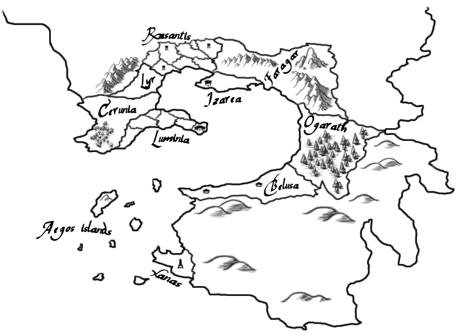

# Introduction

Veridia is the name given to the lands known by men. It spans from east to west for more than one thousand kilometers; it's surrounded by water in every direction except north, where there are instead territories hostile to humans.

Actually, only a subset of Veridia, consisting of the lands close to the sea and the islands, is inhabited by people.

Depending on the specific zone, the citizens sustain themselves with farming, hunting or fishing. Over the years, many civilizations have emerged. Some of them are closely related one another either because of their geographical location or due to similarities in their cultures, while others have grown in total isolation.

Humans have studied and developed a variety of disciplines for the most diverse of objectives; few notable examples are: crafting, carpentry, herboristery, magic, philosophy and warfare.

Small towns, huge cities, castles, stone walls, temples, these are all common sights in Veridia. Differences in architecture are indeed present yet usually not really noteworthy, because men have been travelling back and forth from various countries with regularity in ancient times already; as an old saying goes, ideas travel faster than wind in Veridia.

The so-called mainland has long history rich of joyful and sad event alike. In principle there were only small villages. Under the guidance of capable leaders, these centers became larger and larger up to the point where they could started to be considered small states. Then, the stronger city states subdued the weaker ones, and so big countries appeared.

The flow couldn't be stopped and even these powerful nations had to be sacrificed for the sake of the almighty Empire, seemingly the pinnacle of human civilization. Which, evidently, it was not, since few centuries later it crumbled under the pressure of humans' futile power struggles. The countries made a return, somewhat competing each other for supremacy, as always.

Of course, ambitions didn't die there. The time for religion to shine was not over, the Knight Orders began to leave their mark on the world, magic was always there strong as ever. People sought new lands to colonize, first in the nearby north-east and then in the distant south beyond the inner sea. However, with expansion new challenges arose: keeping peace and stability, minimizing wealth inequality, promoting tolerance.

To make the matters worse the unexpected happened. Savage tribes invaded the southern human colonies and put thousands of lives at risk. Not much later, supporters of a new discipline defied the Council's authority, an event that shook many layers of society. Veridia overcame even these emergencies and although nobody knows what else it will have to face in the future, the confidence is there to say that the outlook is promising.

A solid monetary system, based on the Empire's historical currency, the deli, is shared between all countries; in every corner of the world the right amount of deli will buy you food and shelter. The deli itself is built upon the intrinsic value of the precious materials of which the coins are made of, whilst its worth is kept in check by a joint effort of some governments, the merchant guilds and the Mage Order.

Magic is well recognized around Veridia, yet common people don't have many chances to see wizards in action. The greatest research efforts go into developing recipes useful for warfare, not mundane tasks.

The main artifact of magic are spells; in simple terms, those are patterns to achieve what normal people deem impossible. They come with a lot of variants and different flavours; the Council is very proud of its work in categorizing and documenting almost every type of magic. All that is left shrouded in mystery are forbidden practices and supposedly inferior currents.

Objects infused with magic are uncommon and extremely expensive. Furthermore, the item needs periodic reinforcements to retain its supernatural properties.
